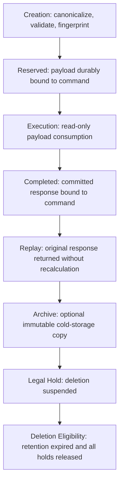

# P2D.18 — Durable Command Contract Freeze

## 1. Executive Summary

This specification freezes the Core V2 durable command envelope before database implementation.

The approved model is:

- One immutable payload per atomic command.
- Separate payload storage from mutable command execution state.
- Canonical JSON-compatible data.
- SHA-256 fingerprint over an explicit projection.
- Versioned payload and fingerprint contracts.
- Multiple lines for the same catalog item are permitted, but each line has immutable identity.
- Line order is behaviorally significant and participates in the fingerprint.
- Monetary values use fixed two-decimal strings.
- Quantities use canonical decimal strings with at most three significant fractional digits.
- Complete pricing, VAT, discount, payment and fulfillment intent is durable.
- Runtime, tracing and transport metadata do not affect idempotency.
- Maximum canonical payload size is 256 KiB.
- Maximum order line count is 100.
- Historical payloads are never rewritten to newer versions.

Frozen initial versions:

- `payload_version`: `order-command-payload-v1`
- `fingerprint_version`: `order-request-fingerprint-v1`
- `command_type`: `order.create`
- Currency: `SAR`
- Currency precision: 2
- Rounding: `invoice-half-up-v1`

---

# 2. Frozen Contracts

## 2.1 Canonical Decimal Contract

### Input representation

All quantities and monetary values MUST enter the canonicalization boundary as JSON strings.

JSON floating-point numbers are prohibited for financial and quantity values.

### Accepted lexical form

Before normalization:

```text
-?(0|[0-9]+)(\.[0-9]+)?
```

Leading zeroes and trailing fractional zeroes may appear in input and are normalized.

The following are prohibited:

- Leading `+`.
- Scientific notation.
- Exponent notation.
- Commas.
- Currency symbols.
- Leading or trailing whitespace.
- Internal whitespace.
- Hexadecimal.
- Octal notation.
- `NaN`.
- Infinity.
- Bare decimal point.
- Missing integer component.
- Trailing decimal point.
- Numeric JSON values for money or quantity.

### Quantity representation

- Canonical type: string.
- Minimum exclusive value: zero.
- Maximum fractional scale: 3 significant fractional digits after trailing-zero removal.
- Leading integer zeroes are removed.
- Trailing fractional zeroes are removed.
- Decimal point is removed when the fractional component becomes empty.
- Negative zero becomes `0`.
- Canonical zero is `0`.
- A non-zero quantity greater than zero is required for an order line.

### Money representation

- Canonical type: string.
- Currency precision: exactly 2 fractional digits.
- Leading integer zeroes are removed.
- Negative zero becomes `0.00`.
- Canonical zero is `0.00`.
- Values with more than two non-zero fractional digits are rejected.
- Input may contain additional trailing zeroes beyond two digits, but only when removing those zeroes leaves at most two fractional digits.
- Money is never rounded during canonicalization. Values requiring rounding are rejected.
- Approved financial calculation performs rounding separately under `invoice-half-up-v1`.

### Examples

| Input | Canonical quantity | Canonical money |
|---|---:|---:|
| `1` | `1` | `1.00` |
| `1.0` | `1` | `1.00` |
| `1.00` | `1` | `1.00` |
| `001.000` | `1` | `1.00` |
| `0.10` | `0.1` | `0.10` |
| `0.1000` | `0.1` | `0.10` |
| `-0` | `0` | `0.00` |
| `-0.00` | `0` | `0.00` |
| `1.234` | `1.234` | Rejected |
| `1.2300` | `1.23` | `1.23` |
| `1e2` | Rejected | Rejected |
| `+1` | Rejected | Rejected |
| `.5` | Rejected | Rejected |
| `1.` | Rejected | Rejected |

## 2.2 Duplicate Item Policy

**Policy C — allow multiple lines.**

Multiple lines may reference the same catalog item.

### Line identity

Every line has:

- `line_id`: immutable canonical lowercase UUID.
- `line_number`: immutable sequential integer.
- `catalog_item_id`: canonical lowercase UUID.

`line_id` MUST be unique within the payload.

`line_number` MUST:

- begin at 1;
- increase by 1;
- contain no gaps;
- contain no duplicates;
- match the line’s array position after canonical ordering.

A replayed request must preserve the original `line_id`.

### Modifier identity

Each modifier has:

- `modifier_id`: immutable canonical lowercase UUID.
- `modifier_type`.
- `option_id`: canonical lowercase UUID or explicit null.
- `value`.
- `quantity`.
- `price_adjustment`.

Modifier IDs must be unique within their line.

Modifier order has no business meaning. Modifiers are canonically sorted by:

1. `modifier_type` using Unicode code-point order;
2. `modifier_id`;
3. `option_id`, with null before non-null;
4. canonical `value`;
5. canonical quantity;
6. canonical price adjustment.

Duplicate modifier identities are rejected.

### Quantity behavior

Quantities belong to individual lines and are never merged automatically.

Two lines with the same catalog item remain distinct when they have:

- different modifiers;
- different fulfillment treatment;
- different pricing evidence;
- different notes;
- different line identities;
- intentionally separate line presentation.

No hidden aggregation occurs during issuance or execution.

## 2.3 Item Ordering Contract

Item ordering affects the fingerprint.

Reasons:

- Line-specific discount allocation can depend on line sequence.
- Fulfillment instructions can be line-specific.
- Multiple lines may reference the same item.
- Response and invoice line ordering must remain deterministic.
- Reordering lines is an observable order-intent change.

Canonical ordering:

1. Sort lines by numeric `line_number` ascending.
2. Require the resulting sequence to be exactly `1..N`.
3. Require each line’s stored array position to equal `line_number`.
4. Reject duplicate or missing line numbers.
5. Do not reorder lines by catalog item, name, price or UUID.
6. Canonically sort only modifier collections using the modifier algorithm above.

---

# 3. Complete Classification Tables

## 3.1 Fingerprint Projection Matrix

`Included` means the canonical field participates directly.

`Derived` means the field is recomputed from included fields and not independently hashed.

`Excluded` means it may be stored but does not participate.

`Internal only` means it is database/runtime lifecycle state outside the immutable business projection.

| Payload field | Classification |
|---|---|
| `payload_version` | Included |
| `fingerprint_version` | Excluded |
| `command_type` | Included |
| `tenant_id` | Included |
| `branch_id` | Included |
| `authenticated_actor_id` | Included |
| `customer.mode` | Included |
| `customer.customer_id` | Included |
| `customer.expected_record_version` | Included |
| `customer.normalized_phone` | Included |
| `customer.display_phone` | Included |
| `customer.name` | Included |
| `customer.email` | Included |
| `customer.address` | Included |
| `customer.notes` | Included |
| `customer.allowed_update_fields` | Included |
| `customer.conflict_behavior` | Included |
| `items[].line_id` | Included |
| `items[].line_number` | Included |
| `items[].catalog_item_id` | Included |
| `items[].name_snapshot` | Included |
| `items[].sku_snapshot` | Included |
| `items[].category_snapshot` | Included |
| `items[].item_type_snapshot` | Included |
| `items[].quantity` | Included |
| `items[].unit_snapshot` | Included |
| `items[].inventory_tracking_mode` | Included |
| `items[].fulfillment_class` | Included |
| `items[].line_note` | Included |
| `items[].modifiers[].modifier_id` | Included |
| `items[].modifiers[].modifier_type` | Included |
| `items[].modifiers[].option_id` | Included |
| `items[].modifiers[].value` | Included |
| `items[].modifiers[].quantity` | Included |
| `items[].modifiers[].price_adjustment` | Included |
| `pricing.currency` | Included |
| `pricing.currency_precision` | Included |
| `pricing.subtotal` | Included |
| `pricing.taxable_subtotal` | Included |
| `pricing.total` | Included |
| `pricing.rounding_strategy` | Included |
| `pricing.price_version` | Included |
| `pricing.branch_pricing_version` | Included |
| `pricing.quote_reference` | Included |
| `pricing.quote_version` | Included |
| `pricing.quote_fingerprint` | Included |
| `pricing.financial_engine_version` | Included |
| `pricing.lines[].line_id` | Included |
| `pricing.lines[].unit_price` | Included |
| `pricing.lines[].pricing_source` | Included |
| `pricing.lines[].source_catalog_id` | Included |
| `pricing.lines[].source_branch_price_id` | Included |
| `pricing.lines[].source_catalog_version` | Included |
| `pricing.lines[].source_branch_price_version` | Included |
| `pricing.lines[].gross_amount` | Included |
| `pricing.lines[].discount_allocation` | Included |
| `pricing.lines[].taxable_amount` | Included |
| `pricing.lines[].vat_amount` | Included |
| `pricing.lines[].net_amount` | Derived |
| `vat.mode` | Included |
| `vat.tax_inclusive` | Included |
| `vat.setting_id` | Included |
| `vat.rate` | Included |
| `vat.amount` | Included |
| `vat.rule_version` | Included |
| `vat.effective_at` | Included |
| `discount.id` | Included |
| `discount.source` | Included |
| `discount.name_snapshot` | Included |
| `discount.type` | Included |
| `discount.value` | Included |
| `discount.amount` | Included |
| `discount.eligibility_version` | Included |
| `discount.rule_version` | Included |
| `payment.method` | Included |
| `payment.amount_tendered` | Included |
| `payment.expected_status` | Included |
| `payment.cash_received` | Included |
| `payment.remaining_from_customer` | Included |
| `payment.cash_change` | Included |
| `payment.rule_version` | Included |
| `payment.masked_instrument` | Excluded |
| `payment.provider_reference` | Excluded |
| `fulfillment.method` | Included |
| `fulfillment.branch_id` | Included |
| `fulfillment.requested_at` | Included |
| `fulfillment.address` | Included |
| `fulfillment.instructions` | Included |
| `order.note` | Included |
| `metadata.source_channel` | Included |
| `metadata.request_reference` | Excluded |
| `metadata.offline_draft_id` | Excluded |
| `metadata.correlation_id` | Excluded |
| `metadata.trace_id` | Excluded |
| `metadata.device_id` | Excluded |
| `metadata.pos_terminal_id` | Excluded |
| `metadata.client_version` | Excluded |
| `metadata.feature_flags` | Excluded |
| `versions.customer_engine` | Included |
| `versions.financial_engine` | Included |
| `versions.inventory_engine` | Included |
| `versions.numbering_engine` | Included |
| `versions.authorization_contract` | Included |
| `versions.payload_contract` | Derived |
| `issuance.issued_at` | Internal only |
| `issuance.expires_at` | Internal only |
| `issuance.created_by_identity` | Internal only |
| `issuance.authorization_context_id` | Internal only |
| `issuance.command_id` | Internal only |
| `issuance.idempotency_key_hash` | Internal only |
| `issuance.request_fingerprint` | Derived |
| `retention.retain_until` | Internal only |
| `retention.legal_hold` | Internal only |
| `archive.reference` | Internal only |
| `archive.hash` | Internal only |

## 3.2 Metadata Classification

| Metadata | Stored | Fingerprint | Replay output | Audit evidence |
|---|---:|---:|---:|---:|
| `correlationId` | Yes | No | Yes | Yes |
| `requestReference` | Yes | No | No | Yes |
| `offlineDraftId` | Yes when supplied | No | No | Yes |
| `sourceChannel` | Yes | Yes | Yes | Yes |
| `traceId` | No in payload; operational trace only | No | No | Yes, externally |
| `deviceId` | Yes only as approved pseudonymous ID | No | No | Yes |
| POS terminal ID | Yes | No | No | Yes |
| `clientVersion` | Yes | No | No | Yes |
| `engineVersion` | Yes | Yes | Yes | Yes |
| `featureFlags` | Yes as behavior-affecting evaluated values only | No as raw flags | No | Yes |
| Authorization-context ID | No in business payload | No | No | Yes, command ledger |
| Command ID | No in business payload | No | Yes | Yes |
| Idempotency key | Never | No | No | No |
| Idempotency key hash | Command ledger only | No | No | Yes |
| Issuance timestamp | Lifecycle record | No | Yes | Yes |
| HTTP headers | No | No | No | No |
| User agent | No | No | No | No |
| IP address | No in command payload | No | No | Separate security evidence only |

Raw feature-flag collections are not stored. Only behaviorally relevant evaluated contract versions belong in the payload.

## 3.3 Payload Classification Matrix

| Field group | Classification | Protection |
|---|---|---|
| Command type and versions | Operational/Audit | Integrity, immutable |
| Tenant and branch IDs | Operational/Audit | Tenant isolation |
| Actor ID | Sensitive/Audit | Restricted access |
| Customer ID | Sensitive | RLS, restricted output |
| Customer name | Sensitive | Encryption at rest, redaction |
| Customer phone | Sensitive | Normalization, redaction |
| Customer email | Sensitive | Redaction |
| Customer address | Highly Sensitive | Minimum retention, restricted access |
| Customer notes | Sensitive | Bounded, no secrets |
| Catalog IDs | Operational | Integrity |
| Item descriptions/SKU | Operational/Audit | Immutable snapshot |
| Quantities | Operational/Audit | Canonical decimal |
| Modifiers/options | Operational | Bounded depth and count |
| Prices and totals | Operational/Audit | Immutable financial evidence |
| VAT evidence | Operational/Audit | Immutable |
| Discount evidence | Operational/Audit | Immutable |
| Payment-method class | Sensitive/Operational | Restricted output |
| Tendered/cash values | Sensitive/Audit | Restricted output |
| Masked payment instrument | Highly Sensitive | Optional, separately approved |
| Full card number | Never Stored | Reject |
| CVV/CVC | Never Stored | Reject |
| PIN/PIN block | Never Stored | Reject |
| Card track data | Never Stored | Reject |
| Provider token | Never Stored | Reject |
| Bearer/auth token | Never Stored | Reject |
| Session cookie | Never Stored | Reject |
| Password/POS PIN | Never Stored | Reject |
| Provider API key | Never Stored | Reject |
| Fulfillment address | Highly Sensitive | Minimum retention |
| Fulfillment instructions | Sensitive | Bounded and redacted |
| Order note | Sensitive | Bounded and redacted |
| Source channel | Operational/Audit | Integrity |
| Offline draft ID | Sensitive/Audit | Pseudonymous |
| Device/terminal ID | Sensitive/Audit | Pseudonymous |
| Correlation ID | Operational/Audit | Safe bounded format |
| Trace ID | Audit, external only | No payload storage |
| Internal stack/error | Never Stored in payload | Sanitize |
| Archive reference/hash | Audit/Internal | Restricted lifecycle access |
| Legal-hold evidence | Audit/Internal | Restricted authority |

---

# 4. Immutable Pricing Snapshot

Required payload fields:

| Contract | Frozen requirement |
|---|---|
| Currency | `SAR` for payload v1 |
| Currency precision | 2 |
| Quantity precision | Maximum 3 fractional digits |
| VAT mode | `exclusive`, `inclusive`, `exempt`, or `zero_rated` |
| Tax-inclusive flag | Explicit boolean; must agree with VAT mode |
| Pricing source | Per line: `branch_override` or `catalog_default` |
| Price version | Required opaque immutable source version |
| Branch pricing version | Required for branch override; null otherwise |
| Catalog source | Catalog ID and source version |
| Branch price source | Branch-price ID and source version or null |
| Discount source | `none`, `rule`, or approved manual source |
| Discount type | `percentage`, `fixed`, or null |
| Discount rule version | Required when a discount applies |
| VAT rule version | Required |
| Rounding strategy | `invoice-half-up-v1` |
| Quote version | `financial-quote-v1` for payload v1 |
| Financial engine version | `financial-engine-v2-r1` for payload v1 |
| Quote reference | Required immutable reference |
| Quote fingerprint | Required SHA-256 evidence |
| Subtotal | Canonical money |
| Discount amount | Canonical money |
| Taxable subtotal | Canonical money |
| VAT amount | Canonical money |
| Total | Canonical money |
| Line unit price | Canonical money |
| Line gross amount | Canonical money |
| Line discount allocation | Canonical money |
| Line taxable amount | Canonical money |
| Line VAT amount | Canonical money |

Intentionally omitted:

- Current mutable catalog price after issuance: irrelevant.
- Current mutable VAT configuration after issuance: irrelevant.
- Current mutable discount rule after issuance: irrelevant.
- Provider payment secrets: prohibited.
- Final invoice identifiers: execution output, not issuance intent.
- Final legal financial classification: established by committed invoice and invoice items.

The snapshot is authoritative execution input. The committed invoice remains the authoritative posted financial truth.

---

# 5. Payload Lifecycle



## Lifecycle invariants

### Creation

- Payload and fingerprint are produced under one frozen version contract.
- Forbidden sensitive fields are rejected.
- Size and structural limits are checked.
- Authorization context, command and payload commit atomically.

### Reserved

- Payload is immutable.
- Exactly one payload belongs to the command.
- Command is not executable if the payload is missing or corrupt.
- Fingerprint equality must be verifiable.

### Execution

- Executor reads the stored payload.
- Executor never rewrites or upgrades it.
- Mutable customer/catalog/VAT/discount state cannot replace stored intent.
- Execution version support is checked before mutation.

### Completed

- Payload remains unchanged.
- Committed response snapshot is stored separately.
- Invoice and invoice items become authoritative financial truth.
- Payload remains supporting execution and audit evidence.

### Replay

- Replay returns the committed response.
- Replay does not recalculate prices, VAT, discounts or inventory.
- Replay does not create another order.
- Replay does not modify the payload.

### Archive

- Live payload may be archived only after approved replay and operational periods.
- Archive content must retain exact canonical bytes or an equivalent lossless representation.
- Archive hash must equal the live payload fingerprint contract.
- Archive availability must be verified before live deletion eligibility.

### Legal hold

- Legal hold may be applied at any lifecycle point.
- Legal hold prevents deletion and destructive anonymization.
- Archival does not release legal hold.
- Hold authority and release evidence are immutable audit records.

### Deletion eligibility

Deletion is only eligible when:

- minimum retention has expired;
- replay retention has expired;
- audit retention has expired;
- no dispute exists;
- no legal hold exists;
- archive requirements are satisfied;
- deletion is externally approved;
- command/result evidence can remain internally consistent.

Eligibility does not mean automatic deletion.

---

# 6. Payload Size Contract

| Limit | Frozen value |
|---|---:|
| Expected canonical payload | 4–32 KiB |
| Warning threshold | Greater than 64 KiB |
| Hard maximum | 256 KiB |
| Maximum order lines | 100 |
| Maximum modifiers per line | 20 |
| Maximum nested modifier depth | 3 |
| Maximum total metadata | 4 KiB |
| Maximum order note | 2,000 Unicode scalar values and 8 KiB UTF-8 |
| Maximum line note | 500 Unicode scalar values and 2 KiB UTF-8 |
| Maximum fulfillment instructions | 1,000 Unicode scalar values and 4 KiB UTF-8 |
| Maximum customer notes in payload | 2,000 Unicode scalar values and 8 KiB UTF-8 |
| Maximum individual metadata string | 512 UTF-8 bytes |

Both character and byte limits apply where both are specified.

Justification:

- 100 lines matches the existing financial cart boundary.
- 32 KiB covers ordinary POS orders.
- 64 KiB identifies unusual payload growth without rejecting legitimate orders.
- 256 KiB protects WAL, TOAST, replication, backup and replay performance.
- Metadata is evidence, not an arbitrary extension store.
- Modifier depth prevents recursively unbounded payloads.
- Binary files, images, PDFs and base64 data are forbidden.

Payload size is measured from the exact canonical UTF-8 representation used by the fingerprint contract.

---

# 7. Cross-Version Rules

## Payload-version change

- A semantic or structural contract change requires a new `payload_version`.
- Existing payloads retain their original version.
- Existing payloads are never rewritten.
- A version-specific reader validates every payload.
- Unknown versions are rejected before business mutation.
- Optional additions require a new version unless the current version explicitly reserved the field and its default semantics.
- Removing, renaming or reinterpreting a field always requires a new version.

## Fingerprint-version change

A new `fingerprint_version` is required when changing:

- included fields;
- excluded fields;
- canonical key ordering;
- decimal normalization;
- Unicode normalization;
- array ordering;
- duplicate handling;
- null/omitted semantics;
- UUID formatting;
- hash algorithm;
- canonical byte representation.

The scoped idempotency comparison uses both:

- fingerprint version;
- fingerprint value.

Different fingerprint versions are not assumed equivalent.

## Runtime support

- Runtime declares an explicit supported payload-version set.
- Runtime declares an explicit supported fingerprint-version set.
- Runtime cannot claim support through a generic “latest” alias.
- Runtime may issue only one explicitly configured active version.
- Runtime may read older supported versions for replay and diagnostics.
- Unsupported versions return deterministic version errors.

## Executor support

- Executor declares an explicit supported payload-version set.
- Executor may support fewer versions than the Runtime can replay.
- A reserved command with an unsupported payload version must not begin execution.
- An already completed unsupported version may still replay its stored response.
- Executor version support is checked before lease acquisition or business mutation.

## Cross-version idempotency

- Same scoped key and same fingerprint version/value: same command identity.
- Same scoped key and different fingerprint: conflict.
- Same scoped key and different fingerprint version: conflict unless a future explicitly approved cross-version equivalence contract exists.
- No implicit cross-version canonicalization is permitted.

## Upgrade behavior

- New Runtime deployment must remain able to classify old commands.
- New Executor deployment must not invalidate in-progress supported commands.
- Version support cannot be removed while executable commands of that version remain.
- Archival preserves original version identifiers.

---

# 8. Future Migration Breakdown

## P2D.19 — Immutable Payload Storage

Future scope:

- Separate one-to-one payload relation.
- Version, fingerprint, size and lifecycle columns.
- Ownership.
- RLS and forced RLS.
- Immutability controls.
- Minimal indexes.
- Read-only preflight and post-install attestation.
- No Runtime integration.

## P2D.20 — Trusted Command Acquisition Entrypoint

Future scope:

- Trusted authorization derivation.
- Payload validation.
- Fingerprint verification.
- Idempotency classification.
- Atomic context, command and payload creation.
- Typed acquisition results.
- Security-definer closure.
- No Executor.

## P2D.21 — Runtime Integration

Future scope:

- Canonical payload builder.
- Trusted server principal adapter.
- Typed persistence adapter.
- Acquisition result union.
- Structured error translation.
- Unit and integration tests.
- Feature remains disabled by default.

## P2D.22 — Executor Design

Future scope:

- State-machine consumption.
- Version-specific payload reader.
- Deterministic locking.
- Recovery and retry rules.
- Business transaction boundary.
- No implementation until separately approved.

## P2D.23 — Executor Implementation

Future scope:

- Atomic business execution.
- Invoice and inventory persistence.
- Audit and outbox.
- Response snapshot.
- Failure and recovery handling.
- Isolated validation only.

## P2D.24 — Replay and Concurrency Certification

Future scope:

- Same-key acquisition races.
- Fingerprint conflicts.
- Timeout-after-commit.
- Lease recovery.
- Immutable replay.
- Payload corruption detection.
- Isolated Clone/Staging only.

## P2D.25 — Controlled Activation

Future scope:

- External approvals.
- Canary controls.
- Legacy coexistence.
- Disable path.
- Runtime grants.
- Production execution remains separately gated.

---

# 9. Final Normative Rules

## MUST

1. Every new atomic order command MUST have exactly one immutable payload.
2. Payload, authorization context and command MUST commit in one transaction.
3. The payload MUST contain all information required for deterministic execution.
4. The payload MUST have an explicit `payload_version`.
5. The fingerprint MUST have an explicit `fingerprint_version`.
6. The fingerprint MUST be SHA-256 over the approved canonical UTF-8 projection.
7. Object ordering MUST be locale-independent.
8. Strings MUST use Unicode NFC.
9. UUIDs MUST use lowercase canonical hyphenated form.
10. Money MUST use fixed two-decimal strings.
11. Quantities MUST use canonical decimal strings with no more than three significant fractional digits.
12. Negative zero MUST canonicalize to zero.
13. Item order MUST participate in the fingerprint.
14. Every line MUST have a unique immutable line ID.
15. Line numbers MUST be contiguous starting at 1.
16. Modifiers MUST be canonically ordered.
17. Forbidden sensitive values MUST be rejected before persistence.
18. Payload size MUST be measured using canonical UTF-8 bytes.
19. Payloads above 256 KiB MUST be rejected.
20. Commands with missing, corrupt or unsupported payloads MUST fail before business mutation.
21. Existing scoped idempotency keys MUST be classified atomically.
22. Replay MUST use the committed response snapshot.
23. Historical payload versions MUST remain readable for their approved retention period.
24. Forced RLS and least privilege MUST remain enabled.
25. Error responses MUST be deterministic and sanitized.

## MUST NOT

1. Payloads MUST NOT be stored in mutable response fields.
2. Payloads MUST NOT be reconstructed from mutable catalog, customer, inventory, VAT, discount or POS state.
3. Historical payloads MUST NOT be rewritten to newer versions.
4. Runtime timestamps MUST NOT participate in the request fingerprint.
5. Correlation IDs and trace IDs MUST NOT participate in idempotency identity.
6. Raw idempotency keys MUST NOT be stored in the payload.
7. JSON floating-point values MUST NOT represent money or quantity.
8. Canonicalization MUST NOT use locale collation.
9. Canonicalization MUST NOT round invalid monetary input.
10. Duplicate line IDs or modifier IDs MUST NOT be accepted.
11. Distinct lines MUST NOT be merged automatically.
12. Payloads MUST NOT contain card numbers, CVV, PINs, tokens, passwords or secrets.
13. Payload storage MUST NOT accept arbitrary binary/base64 attachments.
14. Browser, service or worker roles MUST NOT receive direct payload-table access.
15. An application-side read-then-insert sequence MUST NOT determine idempotency.
16. A losing concurrent acquisition MUST NOT leave an authorization context or payload.
17. Archive creation MUST NOT silently alter canonical content.
18. Legal-hold payloads MUST NOT be deleted or destructively anonymized.
19. Unsupported payload versions MUST NOT enter execution.
20. Executor activation MUST NOT precede payload and acquisition certification.

## SHALL

1. The separate payload relation SHALL remain isolated from mutable command state.
2. The command ledger SHALL retain the acquisition fingerprint.
3. The payload record SHALL retain the same fingerprint evidence.
4. A trusted database entrypoint SHALL arbitrate concurrent acquisition.
5. The entrypoint SHALL derive authorization from trusted server/database evidence.
6. The entrypoint SHALL return one typed acquisition disposition.
7. Completed commands SHALL retain a versioned response snapshot.
8. Replay SHALL return historical results without recalculation.
9. Archival SHALL preserve integrity, version and retention evidence.
10. Version support SHALL be explicit, never inferred from “latest.”
11. Retention SHALL account for replay, audit, dispute and legal-hold requirements.
12. Future incompatible behavior SHALL require a new payload or fingerprint version.
13. Runtime and Executor SHALL publish their supported version sets.
14. Every migration phase SHALL remain externally reviewed and independently gated.
15. Core V2 SHALL remain disabled until controlled activation approval.

The behavioral contract is fully frozen for forward storage design. No SQL, migration, source modification, Runtime implementation, Executor work, API change, POS change or Admin change was performed.

**READY FOR P2D.19**