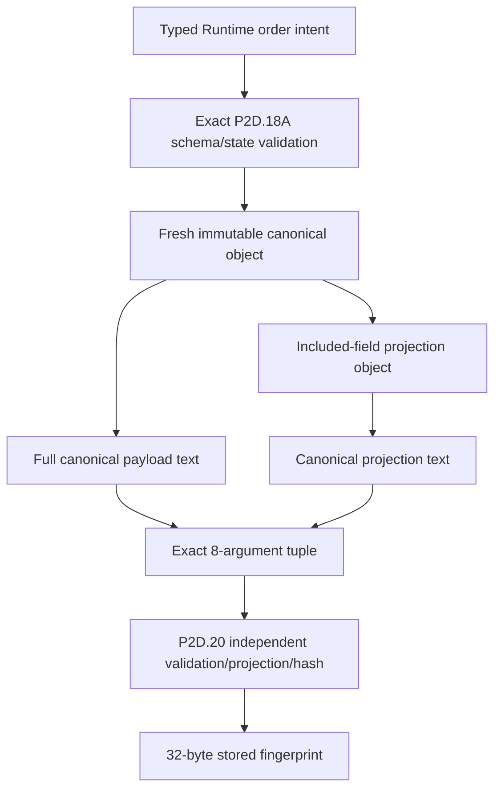

# AFEX ERP / POS — A2.1 Canonical Request Mapping

Status: DESIGN ONLY — P2D.17/P2D.18/P2D.18A REMAIN NORMATIVE

## 1. Exact P2D.20 input order

The future adapter must create one immutable positional tuple in this exact order.
Tenant and branch are requested scope, not proof of authority.

| # | SQL argument | Adapter/A1 field | Trusted source | Validation/normalization | Null/size | Control | Log rule | Failure |
|---:|---|---|---|---|---|---|---|---|
| 1 | `p_authenticated_actor_id` | `authenticatedActorId` | Verified server session | Canonical UUID; must equal authenticated subject mapping | Non-null | Caller cannot override | Correlation only; never log ID by default | `A2_INPUT_INVALID` before RPC |
| 2 | `p_tenant_id` | `tenantId` | Server request scope selected under authenticated session | Canonical UUID; DB proves membership/tenant | Non-null | Requested, not authoritative | Redact/hash only if approved | Input failure; DB may deny |
| 3 | `p_branch_id` | `branchId` | Server request scope | Canonical UUID; DB proves branch access/state | Non-null | Requested, not authoritative | Redact/hash only | Input failure; DB may deny |
| 4 | `p_idempotency_key` | `idempotencyKey` | One caller logical command | A1 identity normalization; ASCII `[A-Za-z0-9._:-]`, 1–512; no trim/fold/replacement | Non-null, 1–512 | Caller-controlled then immutable | Never log | Input failure |
| 5 | `p_correlation_reference` | `correlationReference` | Server request context | A1 safe 1–128 ASCII correlation format | Non-null, ≤128 | Adapter/request infrastructure | May log | Input failure |
| 6 | `p_canonical_payload` | `canonicalPayload` | Adapter-derived from validated intent | Exact P2D.18A canonical UTF-8 JSON text | Non-null, 2–262,144 bytes | Adapter-computed, immutable | Never log | Canonicalization failure |
| 7 | `p_fingerprint_projection` | `fingerprintProjection` | Derived from validated canonical object | Exact included-field projection serialized by same algorithm | Non-null, ≤262,144 bytes | Adapter-computed, immutable | Never log | Projection failure |
| 8 | `p_retain_until` | `retainUntil` | Approved retention policy | Canonical instant converted without precision loss to driver timestamptz | Non-null; DB enforces boundary | Policy-computed | Log duration class only | Policy/input or DB failure |

The database returns authorization; fields 1–3 merely identify the authenticated
actor candidate and requested tenant/branch scope.

## 2. Canonical request model

Canonical version is fixed by the installed contract:

- command type: `order.create`;
- payload version: `order-command-payload-v1`;
- fingerprint version: `order-request-fingerprint-v1`;
- financial engine: `financial-engine-v2-r1`.

The Runtime canonical object uses exactly the root and nested allowlists frozen in
P2D.18A: actor, tenant, branch, customer, items and flat modifiers, pricing and
pricing lines, VAT, discount, payment, fulfillment, order, metadata, and versions.
No unspecified key is permitted.

Identity treatment:

- actor/tenant/branch canonical UUID strings participate according to P2D.18A;
- metadata correlation is excluded from fingerprint identity;
- raw idempotency key is not embedded in the payload and is hashed separately by
  P2D.20;
- authorization roles/capabilities are never supplied in payload;
- database-issued context/command IDs and timestamps are not canonical inputs.

## 3. Frozen representation rules

| Rule | Design | Classification |
|---|---|---|
| Object keys | Unicode scalar-value order; shorter prefix first; no locale or UTF-16 ordering | `EXACT_FROM_P2D18A` |
| Whitespace | None; no BOM/trailing newline | `EXACT_FROM_P2D18A` |
| Strings | NFC; exact escaping; control chars as uppercase `\\u00XX`; literal non-ASCII/U+2028/U+2029 | `EXACT_FROM_P2D18A` |
| Unicode | Reject unpaired surrogates; Runtime NFC mandatory; DB revalidates with documented caveat | `EXACT_FROM_P2D18A` |
| JSON numbers | Schema-declared non-negative integers only, minimal ASCII | `EXACT_FROM_P2D18A` |
| Money | JSON string, non-negative, exactly currency scale (SAR precision 2 where specified), no plus/exponent/negative zero | `EXACT_FROM_P2D18A` |
| Quantity | Canonical decimal string, bounded scale/precision from frozen schema, no redundant zeros/exponent | `EXACT_FROM_P2D18A` |
| Timestamp | `YYYY-MM-DDTHH:mm:ss.SSSSSSZ`, UTC, six digits, valid date, no leap second/offset | `EXACT_FROM_P2D18A` |
| UUID | Lowercase canonical hyphenated form | `EXACT_FROM_P2D18A` |
| Null | Required nullable fields appear as `null`; optional omitted fields do not appear | `EXACT_FROM_P2D18A` |
| Duplicate keys | Reject before ordinary object/JSONB conversion | `EXACT_FROM_P2D18A` |
| Arrays | Schema order; items ascending line number; pricing lines correspond; update fields sorted unique | `EXACT_FROM_P2D18A` |
| Modifiers | Flat, ≤20/item, exact comparator, already sorted; never silently reorder submitted intent | `EXACT_FROM_P2D18A` |
| Unsupported values | Reject floats outside declared integers, undefined, bigint JSON values, symbols, functions, accessors, cycles, inherited properties | `RUNTIME_POLICY` consistent with A1 |

## 4. Payload state matrices

The future Runtime must reproduce the complete P2D.18A field matrix rather than
accept arbitrary JSON. Critical conditional states are:

| State | Frozen structural rule |
|---|---|
| Customer `existing` | ID/version required; snapshots nullable; allowed updates governed by conflict behavior. |
| Customer `create` | ID/version null; normalized phone/name required; updates empty; conflict `reject`. |
| Customer `none` | All customer values null; updates empty; conflict `reject`. |
| Discount `none` | Identity/type/value/version fields null; amount `0.00`. |
| Discount `rule` | UUID/name/type/value/amount/eligibility/rule versions required. |
| Discount `manual` | ID null; name/type/value/amount and approval/rule reference required; eligibility null. |
| Cash | `paid`; cash received covers total; remaining zero; provider reference null. |
| Mada/Visa | `paid`; tender equals total; cash null; remaining/change zero; provider reference optional non-secret. |
| COD | `pending`; canonical tender/cash/remaining; change zero; provider reference null. |
| Catalog default | All branch override identifiers/versions null. |
| Branch override | Required branch pricing/version/ID evidence; root version non-null. |
| Immediate fulfillment | requested/address null; instructions nullable. |
| Pickup/service | requested nullable canonical timestamp; address null. |
| Delivery | requested nullable canonical timestamp; address non-null. |

`trace_id`, `feature_flags`, and `masked_instrument` are forbidden. Device and
terminal IDs are bounded pseudonymous metadata and excluded from fingerprint.
Free-text secret-content detection remains a Runtime responsibility and cannot be
claimed as completely database-provable.

## 5. Four representations

### A. Canonical payload text

Full validated payload serialized using the exact P2D.18A byte algorithm. It is
submitted as text, independently reserialized by PostgreSQL, stored as JSONB, and
bound to `canonical_size_bytes` using the canonical full-payload UTF-8 bytes.

### B. Fingerprint projection text

Derived from the validated canonical object, never accepted as independent
authority. It includes every P2D.18A `Included` field and excludes exactly:

- root `fingerprint_version`;
- `pricing.lines[].net_amount`;
- `payment.provider_reference`;
- metadata other than `metadata.source_channel`;
- `versions.payload_contract`.

Excluded metadata cannot alter idempotent identity.

### C. Stored request fingerprint bytea

Authoritative database value:

```text
SHA-256(canonical fingerprint-projection UTF-8 bytes)
```

It is returned as `bytea`, normalized only by the private adapter bytea boundary,
and never reconstructed from a raw database display string elsewhere.

### D. Immutable stored snapshot

P2D.19 stores one payload per command. The archival payload is the validated full
payload JSONB; its size is bound to the canonical full-payload representation.
Replay returns stored terminal result data, not reconstructed mutable business
data.

## 6. P2D.18A responsibility mapping

| Contract | Runtime | Adapter/driver | PostgreSQL | Status |
|---|---|---|---|---|
| Exact schema/state matrices | Build and validate | Preserve text | Revalidate | `EXACT_FROM_P2D18A` |
| Duplicate-key rejection | Typed construction or duplicate-aware parse | Preserve bytes | Canonical-byte equality | `EXACT_FROM_P2D18A` |
| NFC and scalar ordering | Canonicalizer | UTF-8 pass-through | Revalidate where supported | Cross-Unicode-version parity remains `UNRESOLVED` |
| Canonical serialization | Produce | No mutation | Independently reproduce | `EXACT_FROM_P2D18A` |
| Projection | Derive | No mutation | Independently derive | `EXACT_FROM_P2D18A` |
| SHA-256 | Optional comparison only | Normalize returned bytea | Authoritative hash | `DRIVER_ADAPTER_POLICY` for returned form |
| Full payload size | Precheck | Preserve text | Authoritative octet length | `EXACT_FROM_P2D18A` |
| Secret prose detection | Enforce policy | No logging | Cannot fully prove | `RUNTIME_POLICY` |
| Order financial correctness | Supply frozen quote snapshot | No change | Structural checks only in acquisition | `DEFERRED_TO_ORDER_COMMAND_BATCH`/Executor |
| Retention horizon | Apply approved policy | Preserve timestamp | Validate | `UNRESOLVED` policy value |

PostgreSQL JSONB textual output is not the normative canonical representation.

## 7. Mapping and immutability pipeline



No stage trims, case-folds, silently reorders submitted arrays, merges catalog
lines, substitutes IDs, or inserts an idempotency key.

## 8. Future test vectors

The later canonicalization phase must freeze byte-for-byte vectors for:

- every customer/discount/payment/pricing/fulfillment state;
- ASCII/non-ASCII/scalar key ordering and prefix keys;
- NFC composed/decomposed input and Unicode-version parity;
- every escape rule, U+0000–U+001F, quote, slash, backslash, U+2028/U+2029;
- invalid surrogates and duplicate keys;
- integers, money, quantities, leading/trailing zeros, exponent, `-0`;
- exact timestamp precision, invalid calendar dates, offsets and leap seconds;
- null versus omitted fields;
- item/pricing alignment and flat modifier ordering;
- metadata-only changes producing equal fingerprints;
- included-field changes producing different fingerprints;
- exact full-payload and projection UTF-8 bytes, SHA-256, and size;
- TypeScript/PostgreSQL cross-implementation golden vectors.

## 9. Unresolved canonicalization items

1. Unicode normalization implementation/version must be selected and proven
   against PostgreSQL golden vectors.
2. Exact Runtime source-to-schema mapping for current POS/Admin order models is
   deferred to the order-command batch; no field is invented here.
3. Retention duration/owner is not frozen in repository evidence.
4. The selected driver timestamptz and `bytea` representations require evidence.
