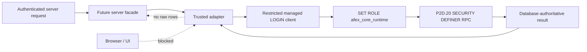
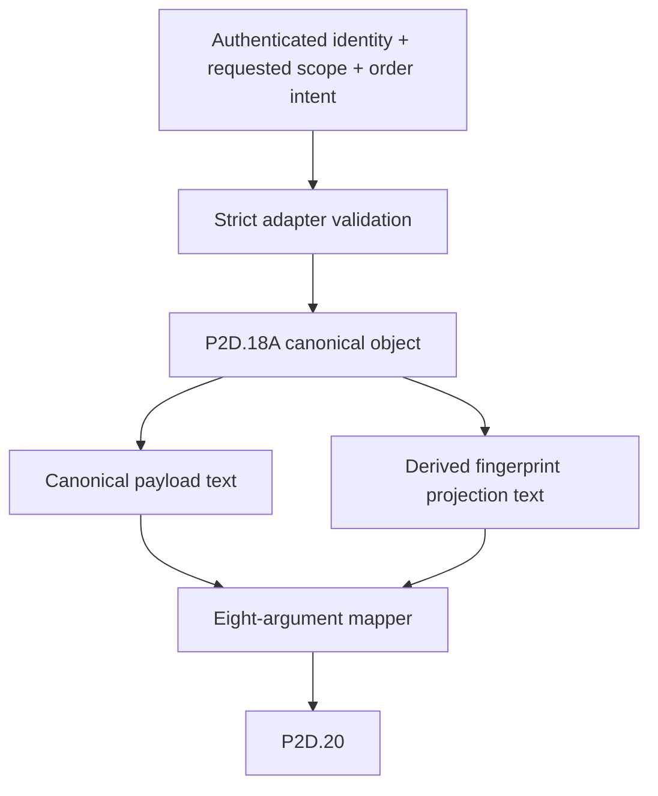
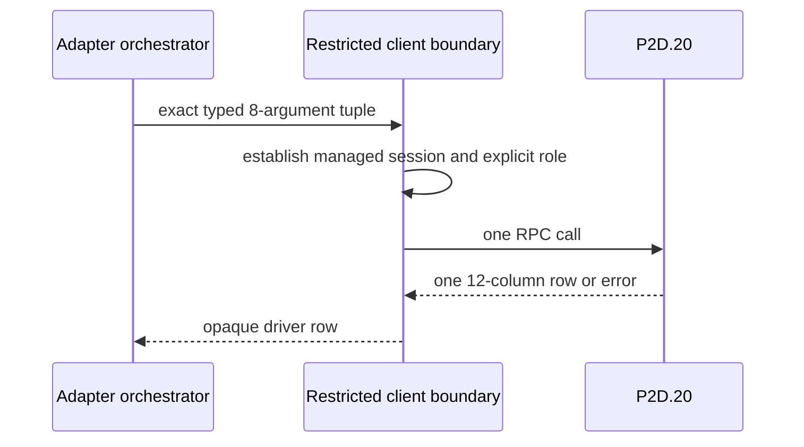
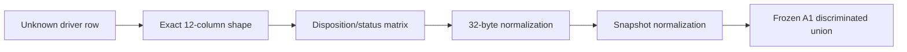
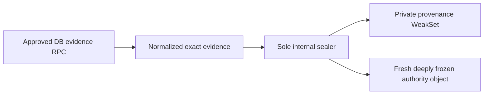
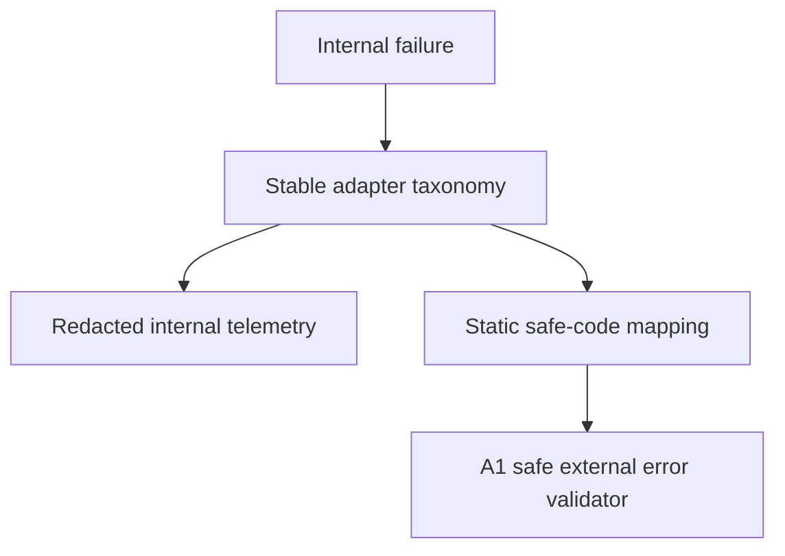
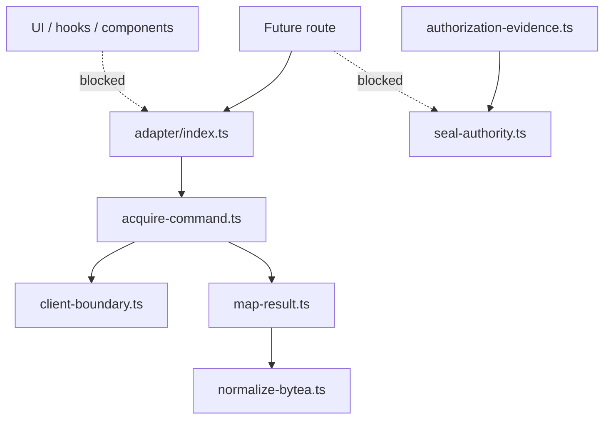
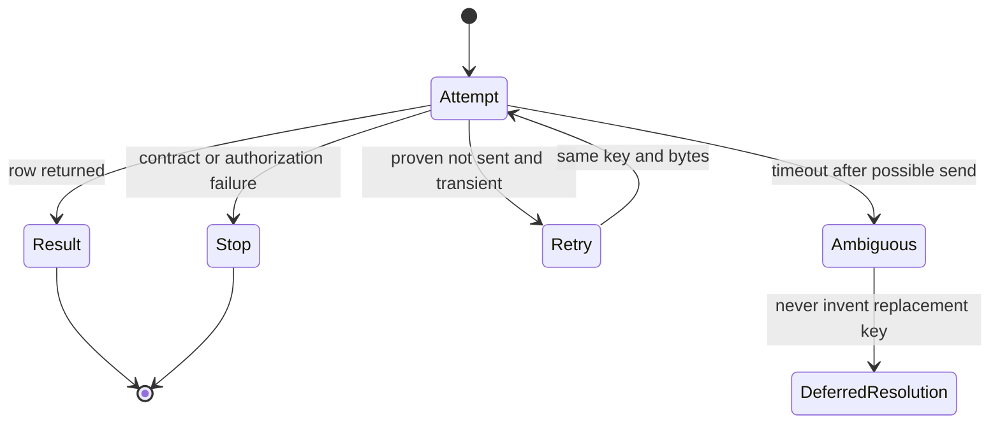

# AFEX ERP / POS — A2.1 Trusted Server Adapter Architecture

Status: DESIGN ONLY — NO IMPLEMENTATION — NO ACTIVATION

Baseline: `7f91f148dd6814f5f4433d4108b1f9da92475fbd`

## 1. Purpose and invariant

The future trusted adapter is the single server-only translation boundary
between authenticated application requests, the A1 contracts, and installed
`public.acquire_atomic_order_command_v1`. It does not become an authorization
authority. It submits identity and scope candidates and accepts only database-
derived authorization and acquisition results.

The adapter may eventually:

1. accept an already authenticated actor identity and requested scope;
2. validate an adapter-owned input contract;
3. canonicalize the frozen P2D.18A request and projection;
4. construct the eight P2D.20 arguments in their installed order;
5. call P2D.20 through one restricted database boundary;
6. normalize driver values without driver leakage;
7. validate disposition-specific invariants;
8. retrieve normalized database authorization evidence through a separately
   approved contract;
9. seal exactly that evidence and return approved A1 contracts; and
10. translate failures into internal diagnostics and approved safe errors.

It must never derive role/capability/employee authority, accept caller authority,
infer authority from payload, replace an idempotency key, perform legacy fallback,
dual-write, write Core V2 tables, expose raw rows, expose secrets, or activate a
route.

## 2. Proposed module topology

No module below exists in A2.1.

| Proposed module | Responsibility | Allowed imports | Forbidden imports | Visibility | Credentials | P2D.20 | Seal | bytea | External errors |
|---|---|---|---|---|---:|---:|---:|---:|---:|
| `adapter/index.ts` | Future server facade; exposes one typed acquisition operation | Adapter contracts, orchestrator | Internals by consumers, UI, React, browser clients | Public server-only facade | No | Indirect | No | No | Returns approved safe contract only |
| `adapter/contracts.ts` | Adapter input, normalized row, client-port, timeout and diagnostic types | A1 contracts only | Clients, environment, network, DB | Internal; types may be re-exported selectively | No | No | No | No | No |
| `adapter/acquire-command.ts` | Orchestrates validation → mapping → one RPC → normalization → evidence → sealing | All internal adapter ports | Legacy writers, direct tables, UI | Internal; facade allowlisted caller | No direct read | Yes, through client port only | Indirect | Indirect | Internal taxonomy only |
| `adapter/map-input.ts` | Maps validated request to the exact eight positional arguments | Contracts, canonicalization | Clients, DB, environment | Internal | No | No | No | No | No |
| `adapter/map-result.ts` | Converts one raw 12-column row to A1 discriminated result | A1 validators, bytea normalizer | UI, clients, unsafe casts | Internal | No | No | No | Yes | Internal failures only |
| `adapter/normalize-bytea.ts` | Strict 32-byte driver-neutral normalization and constant-time equality | Platform byte primitives only | Clients, environment, logs | Internal; direct-import allowlist | No | No | No | Sole normalizer | No |
| `adapter/seal-authority.ts` | Sole authority factory and provenance registrar | A1 private provenance hook, immutable evidence contract | Routes, facade consumers, tests in Production graph | Private internal | No | No | Sole sealer | No | No |
| `adapter/errors.ts` | Stable internal taxonomy, redaction and safe-code mapping | A1 error contracts | Raw external messages, secrets | Internal | No | No | No | No | Sole adapter error translator |
| `adapter/client-boundary.ts` | Creates/reuses restricted managed-LOGIN client and performs explicit role use | Approved secret reader and DB driver only | Browser/Supabase browser client, service-role default, tables | Private internal | Sole location | Sole RPC transport | No | Raw value only | No |
| `adapter/canonicalization.ts` | Implements frozen P2D.18A canonical payload/projection bytes | Pure schema/canonical helpers | DB, network, environment | Internal | No | No | No | No | Canonicalization codes only |
| `adapter/authorization-evidence.ts` | Retrieves and normalizes full database evidence if a future contract is approved | Approved evidence RPC port, contracts | Direct browser reads, local authority derivation | Internal | Through client port | Not P2D.20 | Feeds sealer | No | Internal failures only |

All modules are server-only and unit-testable through injected ports. Only
`client-boundary.ts` may read a credential or call the driver. Only
`acquire-command.ts` may request P2D.20. Only `seal-authority.ts` may register
authority provenance. Only `normalize-bytea.ts` may accept raw fingerprint forms.

## 3. Trusted client and credential decision

### Evidence from installed SQL

- P2D.20 grants `EXECUTE` only to `afex_core_runtime`.
- The function rejects unless `current_setting('role') = 'afex_core_runtime'`.
- `SESSION_USER` must be a non-superuser, non-inheriting managed LOGIN.
- That LOGIN must have exactly one membership: `afex_core_runtime`, with
  `admin_option=false`, `inherit_option=false`, `set_option=true`.
- Direct Runtime table grants are absent; access is through SECURITY DEFINER.

### Option assessment

| Option | Decision | Reason |
|---|---|---|
| Authenticated user-scoped Supabase client | Reject | It cannot satisfy the installed managed-LOGIN and explicit-SET-role contract. |
| Service-role Supabase client | Reject as default | P2D.20 does not grant it execution and A1 forbids service-role default use for Core V2. |
| Dedicated restricted PostgreSQL LOGIN/client | Preferred contract | Matches installed identity checks and least privilege. |
| RPC-only client using an approved server credential | Conditionally viable | Only if evidence proves its session LOGIN and explicit role behavior exactly match P2D.20. |

Final selection: `REQUIRES_READ_ONLY_PRIVILEGE_EVIDENCE`.

Required evidence must identify the registered managed LOGIN, its exact single
membership/options, whether the selected driver preserves a session long enough
for explicit role selection, and whether a pool can prevent role leakage.

Credential design:

- source: server secret store; never `NEXT_PUBLIC_*`;
- creation: `adapter/client-boundary.ts` only;
- browser reachability: impossible by module graph and `server-only`;
- lifetime: bounded pool or per-invocation connection selected after evidence;
- operation allowlist: role establishment, P2D.20, and a future approved
  authorization-evidence RPC only;
- prohibited: arbitrary RPC, direct table access, schema changes, legacy writes;
- logs: client class and stable error code only; no URL, user, password, SQL, or
  raw driver diagnostics;
- timeout/cancellation: driver-enforced deadline plus abort propagation;
- retry: no automatic retry after an ambiguous send until the driver contract is
  proven; any retry reuses the exact idempotency key and canonical bytes;
- cleanup: role/session state must be reset or the connection destroyed before
  pool reuse.

## 4. Sole authority-sealer design

Proposed location: `lib/core-v2/adapter/seal-authority.ts`.

Conceptual signature (not implementation):

```text
sealDatabaseAuthorizationEvidence(
  evidence: NormalizedDatabaseAuthorizationEvidence
): DatabaseAuthoritativeAuthorizationContext
```

Accepted evidence contains exactly the A1 authoritative fields: context ID,
authenticated actor, tenant, branch, stored role, capability version, employee
source and source ID, command type, issued time, and expiry. It contains no
caller role, payload-derived authority, raw row, or database diagnostic.

The function must:

1. validate exact own data properties and values;
2. construct a fresh object rather than brand the input;
3. recursively copy and deep-freeze all nested data;
4. register only the returned object in A1's private provenance registry;
5. return the opaque A1 authority type; and
6. fail closed without returning a partially sealed object.

Direct-import allowlist: only `adapter/authorization-evidence.ts` or one exact
assembly module chosen in A2.2. The facade, routes, generic utilities, fixtures,
and other adapter modules may not import it. Production code gets exactly one
sealer; tests exercise it through the assembly boundary without exporting a test
sealer.

Scanner rule: `core_v2_authority_sealer_import` — error on declaration or import
outside the one frozen file and one allowlisted caller. A second scanner rule,
`core_v2_authority_unsafe_cast`, rejects authority assertions outside the sealer.

Current blocker: P2D.20 returns only `authorization_context_id`, not the full
stored evidence. A separate reviewed retrieval/consumption contract is required
before this sealer can be implemented or called.

## 5. Driver-neutral bytea design

Normalized representation: a fresh immutable lowercase 64-character hex string
branded only inside the adapter as `NormalizedDatabaseFingerprint`. Hex is
driver-neutral, serializable for internal comparison, and does not expose a
mutable typed-array buffer. It is never returned to a browser or logged.

| Raw form | Policy |
|---|---|
| `Uint8Array` | Accept only exact 32 bytes; copy before encoding. |
| Node `Buffer` | Accept as a `Uint8Array` subtype only at the driver boundary; copy. |
| `ArrayBuffer` | Accept only exact 32 bytes; copy. |
| PostgreSQL `\\x` + 64 lowercase/uppercase hex digits | Accept and normalize lowercase. |
| Bare 64-digit hex | Reject unless the selected driver's documented contract requires it and tests freeze that form. |
| Base64 | Reject by default because representation is ambiguous; permit only after driver evidence and an explicit tagged form. |
| Driver-specific object | Reject unless an exact documented adapter is frozen. |
| `null`, arrays, numbers, arbitrary strings | Reject. |

Equality uses constant-time comparison over 32 decoded bytes where supported.
Conversions reject wrong length, odd hex, invalid alphabet, detached buffers,
shared mutable references, and unsupported objects. The brand constructor and raw
value remain internal. Metrics record only success/failure and driver-form class.

## 6. Raw result mapping

All rows must contain exactly the installed 12 columns. Timestamps become exact
validated strings; UUIDs are canonical; snapshots are normalized plain frozen
objects; raw fingerprints pass through the sole bytea normalizer.

| Disposition/status | Required non-null raw fields | Required null raw fields | Runtime result | Execute? |
|---|---|---|---|---:|
| `created/reserved` | context ID, command ID, correlation, status, fingerprint | response version/snapshot, completion, error code/detail/stage | `P2D20CreatedResult` | Yes, once in a later Executor phase |
| `in_progress/reserved|processing|failed_retryable` | context ID, command ID, correlation, status, fingerprint | all response/failure output fields | `P2D20InProgressResult` | No |
| `replay/succeeded` | context ID, command ID, correlation, `succeeded`, response version, plain-object snapshot, completion, fingerprint | error code/detail/stage | successful replay variant | No; return stored terminal result |
| `replay/failed_final` | context ID, command ID, correlation, `failed_final`, error code, failure stage, fingerprint | response version/snapshot, completion; detail may be null | failed-final replay variant | No |
| `fingerprint_conflict/any installed status` | command ID, correlation, status, fingerprint | context ID, response and error fields | conflict result | No; caller must not reuse key for different intent |

Unknown fields, missing fields, extra rows, zero rows, multiple rows, unknown
dispositions, status mismatches, mutable/non-plain snapshots, or malformed bytea
are contract failures. Raw rows never leave the adapter.

## 7. Error taxonomy

| Internal code | Category | Retryable | Severity | Safe mapping eligible | Escalate |
|---|---|---:|---|---:|---:|
| `A2_INPUT_INVALID` | Input validation | No | info | Yes, static catalog | No |
| `A2_CLIENT_CREDENTIAL_UNAVAILABLE` | Client construction | Conditional | error | Yes | Yes |
| `A2_RPC_TRANSPORT_FAILURE` | Transport | Conditional | error | Yes | Threshold |
| `A2_RPC_TIMEOUT` | Timeout | Ambiguous | warning | Yes | Threshold |
| `A2_RPC_CANCELLED` | Cancellation | No automatic retry | info | Yes | No |
| `A2_DATABASE_ROW_MALFORMED` | Raw row | No | critical | Generic only | Yes |
| `A2_DISPOSITION_UNKNOWN` | Unknown disposition | No | critical | Generic only | Yes |
| `A2_STATUS_DISPOSITION_MISMATCH` | Contract mismatch | No | critical | Generic only | Yes |
| `A2_BYTEA_INVALID` | bytea normalization | No | error | Generic only | Yes |
| `A2_AUTHORITY_EVIDENCE_UNAVAILABLE` | Evidence retrieval | Conditional | error | Generic only | Yes |
| `A2_AUTHORITY_SEAL_FAILED` | Provenance | No | critical | Generic only | Yes |
| `A2_CANONICALIZATION_FAILED` | Canonicalization | No | warning | Yes | Repeated only |
| `A2_FINGERPRINT_MISMATCH` | Database contract rejection | No | error | Generic only | Yes |
| `A2_DATABASE_DIAGNOSTIC_UNEXPECTED` | Unexpected SQL diagnostic | No | critical | Generic only | Yes |
| `A2_INFRASTRUCTURE_RETRYABLE` | Proven pre-send infrastructure fault | Yes | warning | Yes | Threshold |
| `A2_CONTRACT_NON_RETRYABLE` | Contract failure | No | error | Generic only | Yes |

Every diagnostic requires a safe correlation ID. Raw database information may
exist only in access-controlled internal telemetry after redaction. User-facing
Arabic text is not chosen here; later A2 uses an approved static catalog.

## 8. Retry, timeout, and `in_progress`

Default design is one RPC attempt. A second transport attempt is permitted only
when the selected driver proves the first attempt was not sent. Ambiguous timeout
or connection loss is resolved by a same-key status/acquisition retry under an
explicit later policy; no replacement key or changed canonical bytes is allowed.

Retry properties:

- same actor/scope, idempotency key, payload, projection, retention, correlation;
- bounded exponential backoff with jitter only for proven transient faults;
- no retry for validation, conflict, malformed row, disposition mismatch,
  canonical mismatch, authorization rejection, or provenance failure;
- abort stops local waiting but does not claim the database transaction stopped;
- transport retry and command execution retry are separate concepts;
- metrics distinguish attempt count from logical acquisition count.

`in_progress` framework:

| Question | Status |
|---|---|
| HTTP 202 vs 409 vs 425 | `REQUIRES_ROUTE_CONTRACT` and `REQUIRES_PRODUCT_DECISION` |
| Retry-After interval | `REQUIRES_PRODUCTION_EVIDENCE` |
| Poll endpoint/terminal retrieval | `REQUIRES_ROUTE_CONTRACT` |
| UI submission lock/duplicate click | `REQUIRES_PRODUCT_DECISION` |
| Same-key invariant | `RESOLVED` — mandatory |
| May execute command again | `RESOLVED` — no |

## 9. Observability

Metrics: logical adapter calls, transport attempts, disposition counts, total/RPC/
mapping latency, timeout, cancellation, malformed row, bytea failure, sealing
failure, fingerprint conflict, in-progress, replay, and credential/client failure.

Allowed log fields: stable event code, correlation ID, disposition, command status,
retryability, attempt ordinal, duration bucket, driver-form class, deployment
environment label, and redacted exception class.

Forbidden: raw idempotency key, canonical payload/projection, raw or normalized
fingerprint, secret, URL, credential username, raw database row/error, full
snapshot, customer/payment data, authorization evidence, stack in external logs.

## 10. Scanner additions

Proposed stable IDs:

| Rule ID | Enforcement |
|---|---|
| `core_v2_authority_sealer_import` | Sealer declaration/import restricted to one file and one caller. |
| `core_v2_authority_unsafe_cast` | No authority cast/brand construction outside sealer. |
| `core_v2_bytea_normalizer_import` | Raw fingerprint normalizer import restricted to result mapper. |
| `core_v2_raw_result_normalizer_import` | Raw-row mapper restricted to orchestrator/tests. |
| `route_core_v2_adapter_internal_import` | Routes cannot import adapter internals. |
| `client_to_core_v2_adapter` | UI/components/hooks cannot reach facade or internals. |
| `core_v2_p2d20_direct_call` | P2D.20 name/call forbidden outside client boundary. |
| `core_v2_runtime_client_creation` | Runtime credential/client construction restricted to client boundary. |
| `core_v2_adapter_ledger_access` | No direct Core V2 table/outbox references. |
| `core_v2_adapter_legacy_fallback` | No legacy fallback or dual write inside adapter. |

Only a future approved server facade may be route-importable, and no route is
allowlisted or activated in A2.1.

## 11. Architecture diagrams

### Trust boundary



### Request mapping



### P2D.20 call flow



### Result normalization



### Authority sealing



### Error translation



### Import allowlist



### Retry and timeout



## 12. Security and activation conclusion

A2.1 adds design documents only. It creates no client, sealer, adapter, RPC call,
route import, feature flag, table access, legacy fallback, or activation path.
