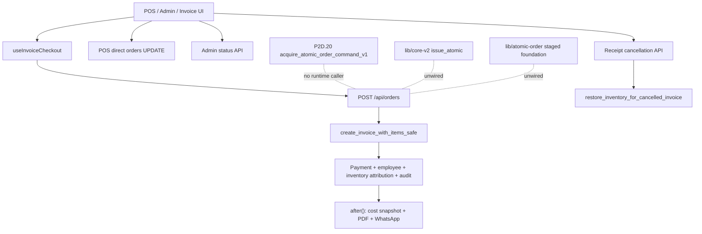
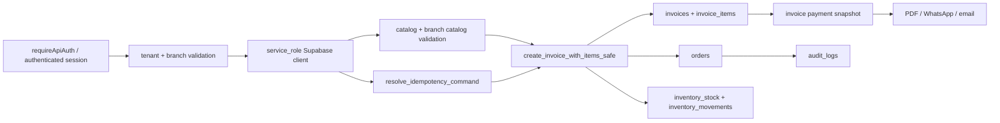

# AFEX ERP / POS — R1.1 Runtime Inventory

Status: repository-only static inventory

## Executive summary

The live order path remains the legacy `POST /api/orders` orchestration around
`create_invoice_with_items_safe`. The RPC creates the order/invoice/items and
performs its legacy inventory work, but the route subsequently persists the
payment snapshot, employee attribution, inventory-movement attribution, and
audit record through separate calls. Those post-RPC writes are not in the same
database transaction as order creation.

The installed Core V2 acquisition entrypoint is not called by application
code. Two repository foundations exist:

- `lib/core-v2/**`: an older in-process issuance model that trusts a
  TypeScript principal and delegates to an abstract persistence adapter;
- `lib/atomic-order/**`: a pure staged execution/domain design with adapters,
  idempotency, financial, inventory, audit, and outbox candidates.

Neither is wired into an API route. The first does not match the installed
trusted database acquisition boundary without adaptation; the second contains
useful reusable domain contracts but no Production persistence implementation.

The highest-risk non-order mutation is receipt cancellation: invoice status is
updated before a separate inventory-restoration RPC. POS and Admin also expose
two distinct order-status mutation paths. Service-role clients are pervasive
across server APIs and bypass RLS, so route-level authorization and explicit
tenant/branch predicates are the controlling boundary.

## Inventory conventions

| Field | Values |
|---|---|
| Legacy/new | `Legacy live`, `Core V2 installed/unwired`, `Foundation only`, `Shared` |
| Blocking | `Critical`, `High`, `Medium`, `Low`, `None` |
| Priority | `P0` first integration batch through `P4` deferred |
| Security impact | Describes privilege, tenant, actor, or atomicity exposure |
| Performance impact | Describes round trips, fan-out, blocking work, or payload cost |

## Runtime architecture map

## Dependency graph

## 1. Orders

| File and line | Feature/path | Legacy/new | Blocking | Priority | Security impact | Performance impact |
|---|---|---|---|---|---|---|
| `hooks/use-invoice-checkout.ts:282-339` | POS and invoice checkout submit `POST /api/orders` with client idempotency key and employee/branch inputs | Legacy live | Critical | P0 | Browser inputs require complete server re-derivation | One blocking HTTP request |
| `app/api/orders/route.ts:664-701` | POST authentication and request normalization | Legacy live | Critical | P0 | Uses `requireApiAuth`, not the installed trusted acquisition RPC | Auth round trip precedes all work |
| `app/api/orders/route.ts:755-778` | Constructs service-role Supabase client and resolves tenant | Legacy live | Critical | P0 | Bypasses RLS; tenant/branch predicates become mandatory | Adds profile/tenant lookup |
| `app/api/orders/route.ts:893-1136` | Branch, employee, catalog, fallback, and idempotency validation | Legacy live | High | P0 | Mixed legacy authorization and caller employee input | Several network round trips before creation |
| `app/api/orders/route.ts:1164-1184` | Calls `create_invoice_with_items_safe` | Legacy live | Critical | P0 | Principal boundary is route plus service-role RPC call | Atomic RPC itself is one round trip |
| `app/api/orders/route.ts:1186-1237` | Uncertain-result recovery through legacy idempotency service | Legacy live | High | P1 | Replay/conflict behavior differs from P2D.20 dispositions | Extra recovery query after uncertain RPC |
| `app/api/orders/route.ts:1289-1397` | Payment, order employee, invoice-item lookup, inventory actor patch | Legacy live | Critical | P0 | Successful order can coexist with failed adjunct writes | Three parallel branches, one contains two sequential calls |
| `app/api/orders/route.ts:1399-1422` | Audit write and cost-snapshot scheduling | Legacy live | High | P0 | Audit is outside creation transaction | Audit blocks response; snapshot does not |
| `app/api/orders/route.ts:1444-1456` | PDF/WhatsApp follow-up in `after()` | Shared | Low | P3 | External delivery occurs after success | Correctly outside response-critical transaction |
| `app/api/orders/route.ts:1529-1889` | Employee resolution and invoice follow-up helpers | Legacy live | High | P1 | Multiple profile/pos-profile sources | Variable multi-call latency |
| `app/api/orders/route.ts:1928-1998` | Direct invoice payment-snapshot update and confirmation | Legacy live | Critical | P0 | Not atomic with invoice creation | One update-returning round trip; optional preceding SELECT |
| `app/api/admin/orders/[id]/status/route.ts:51-158` | Authenticated Admin/POS status API with direct service-role order update | Legacy live | High | P1 | Route authorization and tenant/branch checks guard RLS bypass | Read then update |
| `app/pos/page.tsx:644-700` | POS Kanban directly updates `orders` through browser client | Legacy live | High | P1 | Separate RLS-dependent mutation path | Fast single request but duplicates status API |
| `app/pos/order-status/page.tsx:211-250` | POS status page calls Admin status API | Legacy live | Medium | P1 | Uses different authorization boundary than POS home | Duplicate implementation and refresh behavior |
| `app/pos/offline-drafts/page.tsx:104-144` | Replays offline draft to `POST /api/orders`, then requests cost snapshot | Legacy live | High | P1 | Must converge on the same idempotent acquisition path | Two sequential HTTP requests |
| `lib/atomic-order/service.ts:14-31` | Legacy RPC adapter constant | Foundation only | Low | P2 | No direct risk while unused | No runtime effect |
| `lib/core-v2/runtime/issue-atomic.ts:21-101` | In-process `issue_atomic` orchestration | Foundation only | High | P0 | Trusts supplied principal and generated IDs; not the installed DB boundary | No runtime effect; abstract persistence |
| `lib/core-v2/authorization/issue-context.ts:20-125` | TypeScript authorization context and fingerprint construction | Foundation only | High | P0 | Caller-derived authorization conflicts with trusted DB acquisition model | CPU-only while unused |
| `lib/core-v2/commands/issue-command.ts:10-55` | Builds reserved command record | Foundation only | Medium | P1 | Predates durable payload/acquisition return contract | CPU-only while unused |
| `lib/atomic-order/pipeline.ts:129-231` | Ordered atomic stage pipeline | Foundation only | None | P2 | Pure orchestration; reusable after trusted acquisition | No live cost |
| `lib/atomic-order/application.ts:73-131` | Transaction/outbox/rollback ownership model | Foundation only | None | P2 | Correct separation of committed and after-commit work | No live cost |

## 2. Inventory

| File and line | Feature/path | Legacy/new | Blocking | Priority | Security impact | Performance impact |
|---|---|---|---|---|---|---|
| `app/api/admin/inventory/route.ts:95-143` | Inventory read through `get_branch_inventory` | Legacy live | Medium | P2 | Service role requires tenant/branch scope | RPC avoids client fan-out |
| `app/admin/inventory/page.tsx:477-488` | Browser RPC `adjust_inventory_stock` | Legacy live | High | P1 | Relies on authenticated EXECUTE/RLS contract | One RPC |
| `app/admin/inventory/page.tsx:536-546` | Browser RPC low-stock threshold update | Legacy live | Medium | P2 | Direct browser execution surface | One RPC |
| `app/api/admin/catalog/route.ts:169-178` | Ensures inventory row for new/reactivated catalog item | Legacy live | High | P2 | Service-role RPC must enforce tenant | Extra write round trip |
| `app/api/admin/catalog/[id]/route.ts:67-76` | Ensures inventory row after catalog edit | Legacy live | High | P2 | Same secondary mutation path | Extra write round trip |
| `app/api/orders/route.ts:1031-1136` | Catalog/branch override and stock-related validation | Legacy live | High | P0 | Can duplicate validation already inside legacy RPC | Multiple pre-RPC reads |
| `app/api/orders/route.ts:1334-1391` | Invoice-item lookup then inventory actor update | Legacy live | Critical | P0 | Attribution is not part of order transaction | Two sequential database calls |
| `app/api/admin/receipts/[id]/cancel/route.ts:311-357` | Count invoice items and restore already-cancelled invoice inventory | Legacy live | High | P0 | Service-role RPC is the only restoration boundary | Count then RPC |
| `app/api/admin/receipts/[id]/cancel/route.ts:433-497` | Update invoice status then restore inventory | Legacy live | Critical | P0 | Non-atomic cancellation/restoration can leave inconsistent state | Sequential update then RPC |
| `lib/inventory/core.ts:1-343` | Pure inventory validation/hash rules | Foundation only | None | P2 | Reusable deterministic domain logic | CPU-only |
| `lib/inventory/data-loading.ts:1-250` | Inventory evidence loading helpers | Foundation only | Medium | P2 | Must be adapted to trusted tenant/branch evidence | Potential batched reads |
| `lib/atomic-order/adapters.ts:470-548` | Catalog/stock validation adapter | Foundation only | None | P2 | Separates validation from mutation | Two staged reads while unused |

## 3. Payments

| File and line | Feature/path | Legacy/new | Blocking | Priority | Security impact | Performance impact |
|---|---|---|---|---|---|---|
| `hooks/use-invoice-checkout.ts:324-338` | Sends payment method and cash snapshot | Legacy live | Critical | P0 | Server must reject client-derived totals/evidence | Included in checkout request |
| `app/api/orders/route.ts:702-705` | Normalizes payment input | Legacy live | High | P0 | Validation is route-local | CPU-only |
| `app/api/orders/route.ts:1289-1313` | Schedules payment persistence after legacy RPC | Legacy live | Critical | P0 | Failure occurs after committed order/invoice | Parallel but response-blocking |
| `app/api/orders/route.ts:1928-1998` | Updates and confirms invoice payment columns | Legacy live | Critical | P0 | Direct service-role write outside creation transaction | One or two calls |
| `app/api/admin/receipts/[id]/cancel/route.ts:431-497` | Sets cancellation payment status then restores stock | Legacy live | Critical | P0 | Cross-domain state transition is non-atomic | Two blocking calls |
| `lib/invoices/order-payment.ts:1-196` | Payment normalization/snapshot calculation | Shared | None | P1 | Pure logic can be reused in Runtime adapter | CPU-only |
| `lib/atomic-order/persistence.ts:1-360` | Frozen payment persistence candidate | Foundation only | None | P2 | Correctly models payment inside future transaction | No live effect |

No dedicated live `payments` table write was found. Payment state is persisted
on `invoices`.

## 4. Customers

| File and line | Feature/path | Legacy/new | Blocking | Priority | Security impact | Performance impact |
|---|---|---|---|---|---|---|
| `components/invoice-customer-step.tsx:254-370` | Customer search/select/create UI | Legacy live | Medium | P1 | Client requests require tenant-scoped API enforcement | Debounced network calls |
| `components/pos-add-customer-modal.tsx:105-145` | POS customer creation | Legacy live | Medium | P1 | Uses shared customers API | One HTTP request |
| `app/api/customers/route.ts:211-440` | Customer list/search | Legacy live | Medium | P2 | Authenticated Supabase/RLS path | Search variants and pagination |
| `app/api/customers/route.ts:451-568` | Direct customer insert | Legacy live | High | P1 | Separate creation path from order RPC customer handling | Read/validation then insert |
| `app/admin/customers/page.tsx:316-379` | Server Action direct customer update | Legacy live | High | P1 | Third mutation boundary using authenticated client/RLS | One update-returning call |
| `app/api/orders/route.ts:1164-1184` | Legacy RPC creates/resolves customer during checkout | Legacy live | Critical | P0 | Duplicates standalone customer persistence semantics | Inside legacy RPC |
| `lib/invoices/customer.ts:1-240` | Normalization and customer identity helpers | Shared | None | P1 | Reusable after contract comparison | CPU-only |
| `lib/customers.ts:1-220` | Customer mapping/query helpers | Shared | Low | P2 | No direct mutation boundary | CPU/query construction |

## 5. Catalog

| File and line | Feature/path | Legacy/new | Blocking | Priority | Security impact | Performance impact |
|---|---|---|---|---|---|---|
| `components/invoice-items-step.tsx:855-980` | Catalog/category/settings loading | Legacy live | Medium | P2 | Read-only browser/API surface | Multiple cached HTTP requests |
| `app/api/invoice/catalog/route.ts:40-347` | Service-role catalog, branch overrides, and stock read | Legacy live | High | P1 | Explicit tenant/branch scoping is mandatory | Several batched/parallel reads |
| `app/api/admin/catalog/route.ts:239-655` | Catalog reads and direct insert/update | Legacy live | High | P2 | Service-role write surface | Multi-query validation and mutation |
| `app/api/admin/catalog/[id]/route.ts:193-488` | Catalog edit/delete and branch assignment cleanup | Legacy live | High | P2 | Multi-table service-role mutations | Sequential checks and writes |
| `app/api/admin/catalog/upload-image/route.ts:200-280` | Storage upload plus catalog image update | Legacy live | Medium | P3 | Storage and DB mutation are not atomic | Upload then update |
| `app/api/admin/categories/route.ts:225-458` | Category create/reactivate/reassign/delete | Legacy live | High | P2 | Multi-table service-role mutation | Sequential usage checks/writes |
| `app/api/admin/branch-catalog/route.ts:166-494` | Branch assignment read/upsert | Legacy live | High | P2 | Service-role tenant/branch boundary | Several reads then upsert |
| `lib/invoices/catalog.ts:1-300` | Catalog mapping/cache contracts | Shared | None | P2 | Compatible read-side helper | Reduces duplicate client requests |

## 6. Authentication

| File and line | Feature/path | Legacy/new | Blocking | Priority | Security impact | Performance impact |
|---|---|---|---|---|---|---|
| `app/pos/login/page.tsx:192-239` | POS account login | Legacy live | Medium | P2 | Auth endpoint owns credential boundary | One Auth HTTP call |
| `app/api/auth/login/route.ts:44-140` | Auth login plus service-role profile checks | Legacy live | High | P1 | Service role reads authorization profile | Auth plus profile round trips |
| `app/pos/employee-pin/page.tsx:258-341` | PIN submission/session establishment | Legacy live | High | P1 | PIN and employee identity are sensitive | One slow API call plus client lockout |
| `app/api/pos/identify-employee-by-pin/route.ts:148-250` | Auth check, rate limit, actor-scoped PIN RPC, legacy fallback | Legacy live | High | P1 | Fallback preserves deprecated verification path | RPC fallback can double latency |
| `app/api/admin/create-user/route.ts:381-680` | `hash_pos_pin`, `set_pos_pin`, Auth user and profile creation | Legacy live | High | P2 | Multiple compensating service-role writes | Many sequential calls |
| `app/api/admin/reset-user-pos-pin/route.ts:219-359` | Hash PIN plus insert/update pos profile | Legacy live | High | P2 | Direct credential material lifecycle | RPC then write |
| `app/api/admin/update-pos-user/route.ts:113-1464` | Hash PIN/Auth/profile/pos-profile conversion flows | Legacy live | Critical | P2 | Large multi-system service-role workflow | Very high fan-out |
| `app/api/onboarding/create-tenant/route.ts:322-402` | `create_tenant_with_owner`, then welcome email | Legacy live | High | P2 | Atomic tenant RPC is a strong boundary | RPC plus after-commit email |

`verify_pos_pin_for_actor` is the preferred live PIN function.
`verify_pos_pin` remains a runtime fallback and migration-era compatibility
surface. `hash_pos_pin` and `set_pos_pin` are still active in Admin flows.

## 7. Authorization

| File and line | Feature/path | Legacy/new | Blocking | Priority | Security impact | Performance impact |
|---|---|---|---|---|---|---|
| `lib/api-auth.ts:1-300` | Current API authorization and profile context | Legacy live | Critical | P0 | Primary guard for service-role routes | Auth/profile reads per request |
| `lib/authorization-context.ts:94-311` | Capability/branch context and dual profile employee verification | Foundation/shared | High | P0 | Better structured but not used by order POST | Parallel employee reads when invoked |
| `app/api/orders/route.ts:690-778` | Legacy auth plus independent tenant resolution | Legacy live | Critical | P0 | Does not invoke P2D.20 trusted acquisition | Duplicate auth evidence reads |
| `lib/core-v2/authorization/issue-context.ts:20-125` | Caller-principal capability authorization | Foundation only | Critical | P0 | Must not become the authority for P2D.20 | No live effect |
| `P2D.20 acquire_atomic_order_command_v1` references | Repository SQL only; no TypeScript caller found | Core V2 installed/unwired | Critical | P0 | Trusted acquisition boundary is unused | No live traffic |

## 8. POS

| File and line | Feature/path | Legacy/new | Blocking | Priority | Security impact | Performance impact |
|---|---|---|---|---|---|---|
| `app/pos/employee-pin/page.tsx:258` | PIN entry | Legacy live | High | P1 | Sensitive authentication step | Known slow path |
| `app/pos/page.tsx:519-612` | Categories and recent orders load | Legacy live | Medium | P2 | Read-only | Cache mitigates repeat fetches |
| `components/invoice-customer-step.tsx:254-410` | Customer stage | Legacy live | Medium | P1 | Shared API authorization | Debounced search plus category preload |
| `components/invoice-items-step.tsx:855-980` | Items/catalog stage | Legacy live | Medium | P2 | Read-only | Catalog/settings fan-out |
| `app/pos/sale/checkout/page.tsx:287-310` | Checkout prerequisites/settings | Legacy live | Medium | P2 | Read-only | Additional navigation fetch |
| `hooks/use-invoice-checkout.ts:282-380` | Final submit | Legacy live | Critical | P0 | Live financial mutation entrypoint | Full order request latency |
| `app/pos/sale/success/page.tsx:327-520` | Thermal settings, print, follow-up navigation | Legacy live | Low | P3 | No core mutation | Settings fetch and print rendering |
| `app/pos/offline-drafts/page.tsx:104-144` | Offline replay | Legacy live | High | P1 | Must preserve idempotency across retries | Sequential order/snapshot requests |
| `app/pos/page.tsx:644-700` | Direct order status mutation | Legacy live | High | P1 | Duplicate browser/RLS write path | One request |

## 9. Admin

| File and line | Feature/path | Legacy/new | Blocking | Priority | Security impact | Performance impact |
|---|---|---|---|---|---|---|
| `app/api/admin/orders/[id]/status/route.ts:51-158` | Order status mutation | Legacy live | High | P1 | Service-role route guard | Read then update |
| `app/api/admin/receipts/[id]/cancel/route.ts:211-497` | Cancellation/restoration | Legacy live | Critical | P0 | Cross-domain non-atomic mutation | Several sequential calls |
| `app/api/admin/branches/route.ts:182-643` | Branch create/restore/update/delete-state | Legacy live | High | P2 | Service-role multi-step mutation | Multiple checks and writes |
| `app/api/admin/catalog/route.ts:319-655` | Catalog mutation | Legacy live | High | P2 | Service-role bypass | Validation fan-out |
| `app/api/admin/catalog/[id]/route.ts:193-488` | Catalog edit/delete | Legacy live | High | P2 | Multi-table cleanup | Sequential |
| `app/api/admin/categories/route.ts:225-458` | Category mutation | Legacy live | High | P2 | Multi-table service-role path | Sequential |
| `app/api/admin/discounts/route.ts:248-556` | Discount create/update/deactivate | Legacy live | High | P2 | Financial configuration write surface | Multiple reads/writes |
| `app/api/admin/vat/route.ts:184-206` | VAT update/insert | Legacy live | High | P1 | Financial configuration write surface | One write after checks |
| `app/api/admin/system-settings/route.ts:299-340` | Settings update/insert | Legacy live | High | P2 | Tenant configuration service-role write | Read then write |
| `app/api/admin/branch-catalog/route.ts:432-494` | Branch catalog assignment | Legacy live | High | P2 | Branch-scoped pricing/catalog boundary | Reads then upsert |
| `app/api/admin/create-user/route.ts:381-680` | User/Auth/profile/PIN provisioning | Legacy live | Critical | P2 | Compensating, non-transactional identity workflow | Many calls |
| `app/api/admin/delete-user/route.ts:59-199` | Profile/pos-profile/Auth deletion | Legacy live | Critical | P2 | Partial deletion risk across Auth and DB | Sequential deletes |
| `app/api/admin/update-pos-user/route.ts:113-1464` | Role-mode conversion | Legacy live | Critical | P2 | Largest service-role mutation surface | High fan-out |
| `app/api/admin/update-user-role/route.ts:131-216` | Direct role changes | Legacy live | High | P2 | Authorization state mutation | Multiple writes |
| `app/api/admin/update-user-branch/route.ts:131-244` | Direct branch assignment | Legacy live | High | P2 | Authorization scope mutation | Multiple writes |
| `app/api/admin/toggle-user-status/route.ts:67-194` | User activation | Legacy live | High | P2 | Auth/profile consistency | Reads and writes |
| `app/api/admin/toggle-branch-status/route.ts:65-93` | Branch activation | Legacy live | High | P2 | Tenant operational state | Read then update |

No separate Admin order-creation endpoint was found. Admin invoice/POS creation
converges on `POST /api/orders`.

## 10. Background jobs

| File and line | Feature/path | Legacy/new | Blocking | Priority | Security impact | Performance impact |
|---|---|---|---|---|---|---|
| `app/api/orders/route.ts:1444-1456` | PDF/WhatsApp work in `after()` | Legacy live | Medium | P2 | No durable outbox/retry guarantee visible | Does not block response |
| `app/api/orders/route.ts:1486-1511` | Cost snapshot in `after()` | Legacy live | Medium | P1 | Eventual financial snapshot can fail after success | Does not block response |
| `app/api/account/email-change/route.ts:46-58` | Email notifications in `after()` | Shared | Low | P3 | Runs after confirmed account update | Non-blocking |
| `app/api/admin/create-user/route.ts:712` | Welcome email | Shared | Low | P3 | After provisioning/audit | Non-blocking |
| `app/api/admin/update-pos-user/route.ts:1362` | Welcome email after conversion | Shared | Low | P3 | After identity change | Non-blocking |
| `app/api/onboarding/create-tenant/route.ts:402` | Welcome email after tenant RPC | Shared | Low | P3 | After atomic onboarding | Non-blocking |
| `app/api/support/tickets/route.ts:268` | Support email notification | Shared | Low | P3 | After atomic ticket creation | Non-blocking |
| `app/api/support/tickets/[id]/messages/route.ts:46-54` | Support reply notifications | Shared | Low | P3 | After message persistence | Non-blocking |
| `app/api/provider/support/tickets/[id]/route.ts:158` | Provider update notification | Shared | Low | P3 | After update/event writes | Non-blocking |
| `lib/atomic-order/application.ts:13-131` | Durable outbox candidates/design | Foundation only | None | P2 | Correct future replacement for best-effort callbacks | No live effect |

No live Core V2 outbox worker or queue consumer was found in application code.

## 11. Notifications

| File and line | Feature/path | Legacy/new | Blocking | Priority | Security impact | Performance impact |
|---|---|---|---|---|---|---|
| `app/api/whatsapp/send/route.ts:1-520` | Invoice WhatsApp delivery | Legacy live | Medium | P2 | Provider configuration and customer contact data | External network latency |
| `app/api/send-whatsapp/route.ts:1-180` | Older WhatsApp API surface | Legacy live | Medium | P2 | Duplicate delivery endpoint | Potential duplicate behavior |
| `lib/whatsapp/service.ts:1-360` | Shared delivery orchestration | Shared | Low | P2 | Central provider boundary | External latency |
| `lib/whatsapp/notification-log.ts:1-120` | In-process dedupe/locking | Legacy live | Medium | P2 | Not a durable cross-instance idempotency boundary | Low local overhead |
| `app/api/admin/announcements/route.ts:143-425` | Announcement storage and recipient mutation | Legacy live | High | P3 | Service-role customer targeting | Multi-write workflow |
| `app/api/admin/announcements/[id]/send/route.ts:71-375` | Recipient delivery/update workflow | Legacy live | High | P3 | External notifications and recipient state | Potential large fan-out |
| `app/api/provider/support/notifications/*.ts` | Provider notification RPCs | Legacy live | Low | P3 | Actor-scoped provider RPCs | One RPC per action |
| `lib/auth/email.ts:1-260` | Auth/welcome email delivery | Shared | Low | P3 | Sensitive identity content | External latency in `after()` |
| `lib/support/email.ts:1-205` | Support email delivery | Shared | Low | P3 | Ticket/contact content | External latency in `after()` |

## Service-role usage inventory

The following runtime modules import `supabaseAdmin` or directly consume the
service-role key. Read-only modules are included because they share the same
RLS-bypass boundary.

### Account, authentication, and onboarding

- `app/api/account/email-change/route.ts`
- `app/api/account/route.ts`
- `app/api/auth/check-username/route.ts`
- `app/api/auth/login/route.ts`
- `app/api/onboarding/create-tenant/route.ts`
- `app/api/pos/identify-employee-by-pin/route.ts`

### Orders, invoices, inventory, catalog, and configuration

- `app/api/orders/route.ts`
- `app/api/invoice/catalog/route.ts`
- `app/api/invoices/cost-snapshot/route.ts`
- `app/api/invoices/digital-settings/route.ts`
- `app/api/invoices/pdf/route.ts`
- `app/api/invoices/thermal-settings/route.ts`
- `app/api/admin/orders/[id]/status/route.ts`
- `app/api/admin/receipts/[id]/cancel/route.ts`
- `app/api/admin/inventory/route.ts`
- `app/api/admin/inventory-movements/route.ts`
- `app/api/admin/catalog/route.ts`
- `app/api/admin/catalog/[id]/route.ts`
- `app/api/admin/catalog/upload-image/route.ts`
- `app/api/admin/categories/route.ts`
- `app/api/admin/branch-catalog/route.ts`
- `app/api/admin/branches/route.ts`
- `app/api/admin/discounts/route.ts`
- `app/api/admin/vat/route.ts`
- `app/api/admin/system-settings/route.ts`
- `app/api/admin/system-settings/upload-logo/route.ts`
- `app/api/admin/branch-whatsapp-config/route.ts`

### Identity administration

- `app/api/admin/create-user/route.ts`
- `app/api/admin/delete-user/route.ts`
- `app/api/admin/list-users/route.ts`
- `app/api/admin/reset-user-password/route.ts`
- `app/api/admin/reset-user-pos-pin/route.ts`
- `app/api/admin/toggle-user-status/route.ts`
- `app/api/admin/update-pos-user/route.ts`
- `app/api/admin/update-user-branch/route.ts`
- `app/api/admin/update-user-role/route.ts`

### Support, developer, announcements, and notifications

- `app/api/admin/announcements/route.ts`
- `app/api/admin/announcements/[id]/route.ts`
- `app/api/admin/announcements/[id]/generate-links/route.ts`
- `app/api/admin/announcements/[id]/send/route.ts`
- `app/api/admin/audit-logs/route.ts`
- `app/api/developer/tenants/[id]/route.ts`
- `app/api/developer/users/status/route.ts`
- `app/api/provider/support/**`
- `app/api/support/**`
- `app/api/whatsapp/send/route.ts`
- `lib/audit-log.ts`
- `lib/developer/server.ts`
- `lib/feature-guards.ts`
- `lib/support/**`
- `lib/whatsapp/config.ts`

This is not proof that every use is unsafe. It is the complete review queue
for verifying authentication, authorization, tenant/branch predicates, and
whether a narrower RPC or authenticated client can replace RLS bypass.

## Direct table write inventory

### Financial and operational writes

- `orders`: `app/api/admin/orders/[id]/status/route.ts:156`,
  `app/pos/page.tsx:676`, `app/api/orders/route.ts:1319`.
- `invoices`: `app/api/orders/route.ts:1968`,
  `app/api/admin/receipts/[id]/cancel/route.ts:433`.
- `invoice_items`: `lib/invoices/create-cost-snapshot.ts:148`.
- `inventory_movements`: `app/api/orders/route.ts:1367`.
- `customers`: `app/api/customers/route.ts:553`,
  `app/admin/customers/page.tsx:363`.
- `catalog_items`: Admin catalog/category/upload routes.
- `branch_catalog_items`: Admin branch-catalog/catalog deletion routes.
- `catalog_categories`: Admin categories route.
- `discounts`, `vat_settings`, `system_settings`,
  `branch_whatsapp_configs`: corresponding Admin configuration routes.

### Identity and authorization writes

- `profiles`: account, user administration, developer status, and email
  change routes.
- `pos_profiles`: create/reset/update/delete/toggle Admin routes.
- `branches`: branch CRUD/status and account rename routes.
- `tenants`: account rename route.
- Supabase Auth administration: create, update, delete, and password reset
  routes.

### Support and notification writes

- `support_tickets`, `support_messages`, `support_ticket_events`,
  `support_attachments`.
- `announcements`, `announcement_recipients`,
  `announcement_manual_customers`.
- `audit_logs`.

## RPC inventory and disposition

| RPC | Runtime caller | Disposition |
|---|---|---|
| `create_invoice_with_items_safe` | `app/api/orders/route.ts:701,1183` | Live legacy order engine; replace only after Core V2 adapter and replay tests |
| `get_branch_inventory` | `app/api/admin/inventory/route.ts:143` | Live read RPC; not blocked by order cutover |
| `create_support_ticket_atomic` | `app/api/support/tickets/route.ts:235` | Already atomic and feature-scoped; retain |
| `create_tenant_with_owner` | `app/api/onboarding/create-tenant/route.ts:322` | Already atomic onboarding boundary; retain |
| `verify_pos_pin_for_actor` | `app/api/pos/identify-employee-by-pin/route.ts:238` | Preferred secure PIN path; retain |
| `verify_pos_pin` | Same route at line 250 | Legacy fallback; remove after compatibility evidence |
| `hash_pos_pin` | Admin create/reset/update routes | Active credential helper; retain pending identity redesign |
| `set_pos_pin` | Admin create-user route line 603 | Active credential setter; review with identity batch |
| `resolve_idempotency_command` | `lib/idempotency/service.ts:304` | Legacy route idempotency; superseded for new acquisition |
| `adjust_inventory_stock` | Admin inventory page line 477 | Live authenticated inventory mutation |
| `update_inventory_low_stock_threshold` | Admin inventory page line 536 | Live authenticated inventory configuration |
| `ensure_inventory_stock_for_catalog_item` | Admin catalog routes | Live supporting mutation |
| `restore_inventory_for_cancelled_invoice` | Receipt cancellation route | Live but coupled non-atomically to invoice update |
| `ensure_branch_order_number_prefix` | Admin branches route | Live numbering configuration |
| Provider/support notification RPCs | Provider APIs | Independent of order cutover |
| `acquire_atomic_order_command_v1` | No application caller found | Installed Core V2 acquisition boundary; first integration target |

## Duplicate runtime paths

1. Order status:
   - browser-direct update in `app/pos/page.tsx`;
   - API-mediated update from `app/pos/order-status/page.tsx`;
   - Admin order status API.
2. Customer persistence:
   - customers API insert;
   - Admin Server Action update;
   - customer handling inside legacy order RPC.
3. Employee/PIN persistence:
   - create-user;
   - reset-user-pos-pin;
   - update-pos-user;
   - both `hash_pos_pin` and `set_pos_pin` patterns.
4. Catalog/inventory row provisioning:
   - create catalog route;
   - catalog item route;
   - inventory RPC helpers.
5. WhatsApp delivery:
   - `/api/whatsapp/send`;
   - `/api/send-whatsapp`;
   - order background follow-up.
6. Authorization:
   - `requireApiAuth`;
   - `requireAuthorizationContext`;
   - caller-principal `lib/core-v2` authorization;
   - installed trusted database acquisition.
7. Atomic-order design:
   - `lib/core-v2/**`;
   - `lib/atomic-order/**`;
   - legacy RPC orchestration.

## Dead or currently unwired code

- No runtime import of `issue_atomic` outside `lib/core-v2/index.ts`.
- No runtime caller of `createAtomicOrderFoundation`,
  `createAtomicOrderPipeline`, or `createLegacyOrderCreationAdapter`.
- `lib/atomic-order/**` is exercised by static check scripts, not live routes.
- The installed P2D.20 acquisition function has no TypeScript invocation.
- Core V2 flags exist but do not select a live order path.

These modules should not be deleted during R1; they contain reviewed domain
logic. They require reconciliation into one adapter rather than parallel
activation.

## Legacy authorization findings

- `POST /api/orders` uses `requireApiAuth`, then independently derives tenant,
  branch, employee, and catalog evidence using a service-role client.
- `lib/authorization-context.ts` provides a stronger capability/branch model
  but is not used by the order POST.
- `lib/core-v2/authorization/issue-context.ts` authorizes a caller-supplied
  principal and therefore must not directly replace P2D.20 trusted database
  derivation.
- POS home status mutation relies directly on browser RLS while the other
  status page uses a service-role API.
- Broad service-role use makes omissions in route predicates materially
  security-sensitive.

## Multiple-write and atomicity findings

### Critical

1. Order success precedes payment snapshot, employee attribution, inventory
   attribution, and audit completion.
2. Receipt cancellation updates invoice status before inventory restoration.
3. User provisioning/conversion/deletion spans Auth plus multiple tables with
   compensating cleanup rather than one transaction.

### High

1. Catalog/category deletion and reassignment span multiple direct writes.
2. Branch creation/restoration combines table writes and numbering RPCs.
3. Support provider updates write ticket state then event rows with manual
   rollback attempts.
4. Announcement generation replaces recipient rows in separate operations.

## Functions already compatible with Core V2

### Directly reusable

- Pure normalization and validation in `lib/invoices/order-payment.ts`,
  `lib/invoices/customer.ts`, `lib/inventory/core.ts`,
  `lib/financial/core.ts`, and `lib/idempotency/core.ts`, subject to frozen
  P2D.18A byte-contract comparison.
- Pipeline stage definitions, rollback ownership, and after-commit separation
  in `lib/atomic-order/contracts.ts`, `pipeline.ts`, and `application.ts`.
- Existing `after()` placement for PDF, WhatsApp, email, and cost snapshot is
  structurally compatible with eventual outbox consumption.

### Requires adaptation

- `lib/core-v2/validation/order-request.ts` may provide Runtime validation but
  must exactly match P2D.18A and database canonicalization.
- `lib/authorization-context.ts` can supply request/session context to an
  adapter, but the database must remain authoritative.
- `lib/idempotency/service.ts` is a legacy compatibility path; P2D.20
  acquisition dispositions replace it for Core V2 commands.

### Not compatible as the Production authority

- `lib/core-v2/runtime/issue-atomic.ts` and
  `lib/core-v2/authorization/issue-context.ts` generate/authorize records in
  TypeScript rather than calling the installed trusted acquisition function.

## Blocking issues

| Severity | Issue | Required resolution before cutover |
|---|---|---|
| Critical | No runtime adapter calls P2D.20 | Build one server-only adapter with frozen request/result mapping |
| Critical | Legacy order plus adjunct writes are not one transaction | Keep legacy path isolated until Executor owns complete persistence |
| Critical | Cancellation is non-atomic | Separate reviewed cancellation transaction/RPC design |
| Critical | Competing authorization models | Select trusted DB acquisition as authority; TypeScript performs input/session preparation only |
| High | Two order-status mutation paths | Converge on one authorized API/RPC boundary |
| High | Legacy PIN fallback | Prove no dependency, then remove fallback in a separate identity batch |
| High | Service-role breadth | Audit each route for explicit actor, tenant, branch, and operation checks |
| High | No durable outbox worker | Do not claim durable notification delivery at Runtime cutover |
| Medium | Duplicate Core V2 scaffolds | Reconcile, do not activate both |
| Medium | Catalog/customer mutation fan-out | Keep outside first order cutover, then migrate by domain |

## Recommended integration order

1. **R1.2 — Runtime contract reconciliation**
   - Freeze the TypeScript adapter request/result types against P2D.20.
   - Choose P2D.20 as the sole acquisition authority.
   - Mark old `issue_atomic` persistence as superseded or adapt it without
     activating traffic.
2. **R1.3 — Server-only acquisition adapter**
   - Call only `acquire_atomic_order_command_v1`.
   - Use authenticated session evidence; never expose the function to browser
     clients.
   - Map exactly `created`, `replay`, `in_progress`,
     `fingerprint_conflict`.
3. **R1.4 — Shadow integration in `POST /api/orders`**
   - Preserve legacy response and execution.
   - Compare validation/fingerprint/acquisition output without double writes.
   - Because acquisition is durable, shadow policy needs an explicit
     non-business command lifecycle and approval before implementation.
4. **R1.5 — Executor integration**
   - Implement command claim/execute/complete against reviewed database
     contracts.
   - Move payment, attribution, audit, and outbox persistence into the atomic
     transaction.
5. **R1.6 — Controlled order cutover**
   - One execution path per request.
   - Preserve legacy replay compatibility and response contract.
6. **R2 — Status and cancellation convergence**
   - Replace direct POS order updates.
   - Design atomic cancellation/restoration.
7. **R3 — Identity/Admin mutation consolidation**
   - PIN fallback removal and transactional user workflows.
8. **R4 — Catalog, customer, support, and notification hardening**
   - Domain-specific RPCs/outbox where justified.

## Estimated migration batches

| Batch | Scope | Files likely involved | Database change |
|---|---|---|---|
| 1 | Runtime types and acquisition adapter, no route activation | `lib/core-v2/**`, new server-only adapter, tests | None |
| 2 | POST order integration behind disabled flag | `app/api/orders/route.ts`, adapter, instrumentation tests | None |
| 3 | Executor and full atomic persistence | New Executor modules and reviewed SQL package | Independent SQL review required |
| 4 | Controlled order cutover and replay compatibility | Orders route, checkout regression tests | Possibly none after Executor |
| 5 | Order-status convergence | POS pages and Admin status API | Separate review |
| 6 | Atomic cancellation/restoration | Receipt cancellation route | New/revised RPC review required |
| 7 | Identity/PIN and Admin consolidation | User administration routes | Separate Auth/SQL review |
| 8 | Durable outbox/notifications | Background delivery modules | Worker/runtime and SQL review |

## Validation

- Scope: repository-only static inspection.
- Database connection: none.
- SQL execution: none.
- Application/runtime execution: none.
- Repository files modified: only this inventory.
- Staging: none.
- Commit: none.
- Push: none.

`R1_100_RUNTIME_INVENTORY_COMPLETE`
