# AFEX ERP / POS — R1.2 Critical Path and Decisions

Status: decision register and execution dependency analysis

## Executive critical path

The longest mandatory dependency chain is:

```mermaid
flowchart LR
    A["A Security Foundation"]
    B["B Executor"]
    C["C Atomic Order"]
    F["F Payment"]
    D["D Cancellation"]
    H["H Admin"]
    I["I Outbox"]
    J["J Legacy Closure"]
    K["K Stability"]
    L["L Hyper Performance"]
    M["M Security Audit"]
    N["N Rollout"]
    A --> B --> C --> F --> D --> H --> I --> J --> K --> L --> M --> N
```

Batch E Customer Runtime branches from A and must rejoin before C. Batch G POS
Cutover branches after C/F and rejoins before H/J. The customer branch is short
but immediately blocking because two confirmed defects prevent reliable order
input.

## Highest-risk blockers

| Rank | Blocker | Why critical | Resolution point |
|---:|---|---|---|
| 1 | No Runtime caller for P2D.20 | Installed security boundary is unused | A |
| 2 | No reviewed executor transaction | Acquisition alone cannot create the business order | B |
| 3 | Legacy adjunct writes after order RPC | Partial success violates target atomicity | C/F |
| 4 | Cancellation status and stock restoration split | Can double-restore or leave inconsistent state | D |
| 5 | Competing authorization models | Caller-derived authority could bypass frozen DB evidence | A/J |
| 6 | Customer phone search defect | Cannot select correct existing customer | E |
| 7 | Customer creation defect | Checkout correctly stops but cannot complete | E |
| 8 | Broad service-role surface | Route predicate omission can cross tenant/branch | A/H/M |
| 9 | No durable live outbox worker | Delivery may be lost or duplicated | I |
| 10 | Unresolved payment reversal/provider semantics | Financial state machine cannot be inferred | F |

## Mandatory sequential work

1. A precedes every Core V2 Runtime caller.
2. B precedes C, F, D, and I because those depend on executor transaction and
   result ownership.
3. E completes before C can accept customer-bearing commands.
4. C precedes F and G because payment and UI cutover require an order engine.
5. F precedes D because cancellation must know the financial reversal boundary.
6. D and G precede the related Admin cutover in H.
7. H and I precede J so legacy permissions are not removed prematurely.
8. J precedes K/L so tests and measurements represent the target architecture.
9. K precedes L; correctness is not traded for speed.
10. L precedes M/N so the final audited package equals the rollout package.
11. M precedes N.

## Parallelizable work

| Parallel window | Work | Constraint |
|---|---|---|
| After R1.2 approval | A implementation planning; E read-only evidence; B SQL design | No live activation; B cannot finalize before A contract |
| During B review | E code-only fixes; G browser test design; K test harness design | Do not wire order submit |
| After C contract freeze | F financial design; I event taxonomy; G UI adapter tests | F decisions may change D; I may not activate |
| After F | D implementation; G device regression; H per-domain inventories | H order/cancellation cutover waits for D/G |
| After I/H | J read-only privilege inventory; K failure scenarios | No revocation before H/I exit |
| During K | L baseline tooling and scenario preparation | No optimization changes until K passes |

## Earliest safe limited Production rollout

The earliest branch canary occurs in N only after:

- A through I are complete for the order/cancellation/notification scope;
- J proves legacy isolation without removing required rollback capability;
- K passes correctness, concurrency, replay, isolation, and device tests;
- L establishes accepted performance;
- M reports no unresolved Critical or High security finding;
- the global flag is disabled, the selected tenant/branch is explicitly
  approved, monitoring is live, and rollback has been rehearsed.

No shadow call may invoke P2D.20 merely for comparison because acquisition is a
durable write. Shadow comparison must be read-only or use a disposable isolated
environment.

## Exact legacy-order disable point

Legacy `create_invoice_with_items_safe` may be disabled for a branch when:

1. the route selector is deterministic and records the selected engine before
   any write;
2. the branch flag selects Core V2 exclusively;
3. all acquired commands can be executed, resumed, or replayed;
4. no Core V2 error falls back to legacy;
5. POS and any Admin creation surface use the same route contract;
6. offline drafts preserve idempotency keys;
7. customer defects are closed;
8. canary correctness/SLO/security evidence passes;
9. command and outbox backlogs are within approved thresholds;
10. release authority approves the transition.

Global code/privilege removal waits for J and successful rollout to all intended
cohorts.

## Hyper Performance position

Hyper Performance is Batch L, after J and K, before M and N.

### Entry gate

- Target Runtime paths active in the approved test/canary scope.
- Legacy writers removed or provably isolated.
- Stable behavior and complete K correctness suite.
- Correlated metrics/tracing for HTTP, acquisition, execution, database locks,
  outbox, worker, and provider.
- Representative data volume, devices, concurrency, and failure scenarios.
- Frozen baseline with p50, p95, p99, throughput, error rate, lock wait, command
  age, worker throughput, and outbox lag.

### Exit gate

- Approved SLOs pass under warm, cold, peak, and soak scenarios.
- No regression in authorization, tenant/branch isolation, atomicity,
  idempotency, replay, audit, or error redaction.
- Query-plan/index changes, if any, have independent SQL review and manual
  execution evidence.
- Full K rerun passes and the exact optimized package is sent to M.

## Repository ambiguities

| ID | Question | Why unresolved | Owner/decision gate |
|---|---|---|---|
| Q01 | What exact installed executor functions/state transitions follow acquisition? | P2D.20 supplies acquisition, not the complete live business executor | Database/architecture review in B |
| Q02 | Which `lib/atomic-order/**` modules are contractually approved versus prototypes? | R1.1 proves they are unwired, not their approval status | Engineering review in B |
| Q03 | Can `lib/core-v2/**` be deleted, or is another branch/import outside the scanned Runtime expected? | Repository scan shows no live import, but organizational intent is unknown | User decision in A/J |
| Q04 | Is Admin order creation intentionally the same checkout route? | No distinct endpoint found | Product decision before G/H |
| Q05 | What response status represents `in_progress`—202 or 409? | Must be one stable API contract | API/product decision in A |
| Q06 | What is the accepted legacy-order replay window after cutover? | Determines compatibility retention | Operations/product decision in C/J |
| Q07 | Are current Core V2 feature flags approved for global/tenant/branch control? | R1.1 says flags exist but do not select live traffic | Security/operations review in A |

## Unknown Production behavior

| ID | Evidence required | Blocks |
|---|---|---|
| P01 | Actual customer phone representations, constraints, and indexes | E |
| P02 | Exact cause of customer-create failure using redacted logs | E |
| P03 | Traffic/use of `/api/send-whatsapp` and legacy PIN fallback | J |
| P04 | Order-status writes by browser versus API in Production | H/J |
| P05 | Distribution and age of offline drafts/idempotency keys | C/G |
| P06 | Current branch/tenant/role combinations for POS users | A/G/M |
| P07 | Payment methods, reversal/refund practices, and reconciliation ownership | F/D |
| P08 | Current cancellation inconsistencies or prior partial restores | D |
| P09 | Service-role route usage by integrations not visible in repository | H/J |
| P10 | Provider retry/deduplication guarantees | I |

## Missing tests

- Exact P2D.18A TypeScript/database canonical-byte parity.
- Four-disposition route contract.
- Crash between acquisition, claim, business commit, result response, and worker.
- Cross-tenant and cross-branch hostile requests for every role.
- Concurrent duplicate order and cancellation.
- Offline draft replay across deployment/restart.
- Customer phone variants and duplicate prevention.
- Payment failure/reversal/refund state matrix.
- Worker poison/retry/provider idempotency.
- Mobile/tablet browser flows with slow/interrupted networks.
- Legacy/Core V2 route selector proof that only one writer runs.

## Unclear ownership and financial semantics

| ID | Decision needed |
|---|---|
| O01 | Team/role owning Runtime adapter, executor, worker, and Production flags |
| O02 | Release authority allowed to enable a tenant/branch |
| O03 | Operator allowed to resume acquired commands |
| O04 | Reviewer approving financial invariants and reconciliation |
| O05 | Owner of poison outbox events and provider incidents |
| F01 | Whether payment capture is synchronous evidence or asynchronous provider state |
| F02 | Partial payment support and exact invoice status transitions |
| F03 | Refund/reversal authority, idempotency, and accounting evidence |
| F04 | Treatment of already-cancelled legacy invoices with uncertain restoration |
| F05 | Whether cost snapshot is transactional order data or a durable post-commit event |

## User decisions required

1. Approve P2D.20 as the sole acquisition authority and forbid TypeScript-issued
   authorization contexts.
2. Select the stable API response/status for `in_progress`.
3. Confirm whether Admin creates orders through the same route.
4. Approve the customer defect fix before order integration.
5. Approve branch-first canary and the flag authority chain.
6. Assign financial reviewer for payment/cancellation contracts.
7. Decide the retention period for legacy replay compatibility.
8. Assign worker operational ownership and poison-message escalation.
9. Approve removal criteria for old Core V2 scaffolds and duplicate WhatsApp/PIN paths.

## Production evidence required

- P2D.19/P2D.20 hashes, attestations, role/ACL/RLS drift result.
- Runtime artifact hashes and deployment identity.
- Flag/tenant/branch authorization manifest.
- Customer search/create defect evidence and closure tests.
- Command disposition, state, attempt, age, replay, conflict, and failure metrics.
- Financial/inventory reconciliation.
- Outbox/delivery reconciliation and lag.
- Cross-tenant/branch/role test evidence.
- Canary versus legacy functional and performance comparison.
- Rollback drill and already-acquired-command handling.
- Independent final security review and release approvals.

## Recommended first implementation phase

Begin with **Batch A, Phase A1: Runtime Contract Freeze and Forbidden-Boundary
Tests**.

It should:

- define exact TypeScript input/output types for the installed P2D.20 function;
- define the server-only module boundary and allowed credential factory;
- freeze the four disposition/error mappings and idempotency-key ownership;
- add static tests forbidding browser import, service-role leakage, direct
  ledger writes, and use of caller-principal `issue_atomic`;
- make no route call and activate no traffic.

This is the smallest reversible step that removes ambiguity without creating
business records or requiring SQL.

## Readiness decision

Planning is ready for external architecture review. Implementation is not
authorized by this document, and Batch A must not begin automatically.

`R1_204_CRITICAL_PATH_AND_DECISIONS_COMPLETE`
