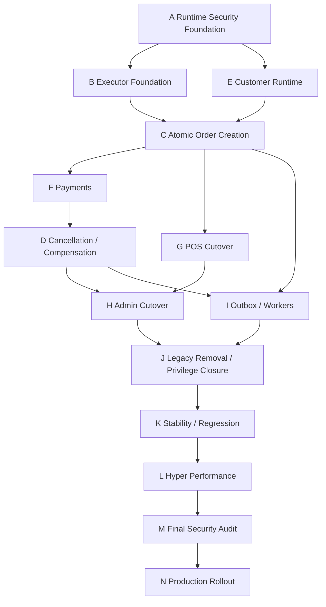

# AFEX ERP / POS — R1.2 Migration Batch Plan

Status: authoritative dependency-aware plan; no implementation

## Authoritative order

| Order | Batch | Name | Effort | Risk | Review | Phases |
|---:|---|---|---|---|---|---:|
| 1 | A | Runtime Security Foundation | L | High | Intensive security/contract | 3 |
| 2 | B | Core V2 Executor Foundation | XL | Critical | Independent SQL, security, concurrency | 5 |
| 3 | E | Customer Runtime | M | High | Functional/security/mobile | 2 |
| 4 | C | Atomic Order Creation | XL | Critical | Financial/security/concurrency | 5 |
| 5 | F | Payments and Financial Consistency | L | Critical | Financial/security | 3 |
| 6 | D | Cancellation and Inventory Compensation | XL | Critical | Financial/inventory/concurrency | 4 |
| 7 | G | POS Runtime Cutover | L | High | Browser/device/operations | 3 |
| 8 | H | Admin Runtime Cutover | XL | High | Authorization/domain | 5 |
| 9 | I | Outbox, Notifications, and Workers | XL | High | Security/delivery/operations | 4 |
| 10 | J | Legacy Removal and Privilege Closure | L | Critical | Independent security/drift | 4 |
| 11 | K | Stability and Regression | XL | Critical | Full-system | 4 |
| 12 | L | Hyper Performance | XL | High | Performance/concurrency | 4 |
| 13 | M | Final Security Audit | L | Critical | Independent final review | 3 |
| 14 | N | Production Rollout | XL | Critical | Release authority/operations | 5 |

Batch E moves before C because the confirmed phone-search and customer-create
defects prevent a reliable order payload and would otherwise contaminate Core
V2 acceptance evidence. Batch I remains after initial order/cancellation
correctness: the executor must first define committed event semantics. Batch L
remains after stability and legacy isolation so performance measurements
represent the target architecture.

## Dependency graph

## Universal gates

Every batch must:

- begin with a clean, reviewed scope and preserve unrelated working-tree work;
- define whether application, SQL, operational, or evidence files may change;
- keep SQL as a separately reviewed artifact and never execute it automatically;
- pass static validation, targeted tests, security review, and `git diff --check`;
- produce its unique completion marker and evidence manifest;
- recommend a commit only after independent review and user authorization;
- stage, commit, push, deploy, or execute Production work only on explicit user
  instruction.

## Batch A — Runtime Security Foundation

- Objective: establish one trusted server boundary and one frozen Runtime
  contract over installed P2D.20.
- Scope/runtime areas: `lib/api-auth.ts`, `lib/authorization-context.ts`,
  `lib/core-v2/**`, `lib/atomic-order/contracts.ts`, server-only Supabase
  construction, safe error/telemetry mapping, idempotency-key lifecycle.
- Prerequisites: P2D.19/P2D.20 installed and attested; R1.2 approved.
- Database dependency: exact installed function signature, role, ACL, and
  disposition contract.
- SQL status: **NO SQL REQUIRED** for adapter design/implementation;
  **READ-ONLY DIAGNOSTIC REQUIRED** before Production enablement if privilege
  drift evidence is stale.
- Security risk: High—incorrect credential or authority selection could bypass
  tenant/branch isolation.
- Functional risk: Medium—mapping mismatch can alter errors or retries.
- Performance risk: Low/Medium—extra auth reads must be deduplicated.
- Rollout risk: Low while unwired.
- Rollback: remove/disable adapter import; no database state is changed.
- Feature flag: none activates traffic; define fail-closed global/tenant/branch
  selector contract.
- Tests: canonical payload fixtures, credentials/forbidden imports, exact four
  dispositions, error redaction, tenant/branch/actor denial.
- Production evidence: function hash/ACL attestation, no browser EXECUTE,
  environment identity, read-only smoke contract.
- Completion marker: `R1_A_RUNTIME_SECURITY_FOUNDATION_COMPLETE`.
- Exit criteria: one server-only adapter contract; P2D.20 is sole acquisition
  authority; legacy `issue_atomic` marked non-authoritative; no route activation.
- Commit recommendation: Yes, one reviewed foundation commit.

## Batch B — Core V2 Executor Foundation

- Objective: implement the server/database executor contract that claims and
  atomically completes acquired commands.
- Scope/runtime areas: new executor adapter, `lib/atomic-order/pipeline.ts`,
  `application.ts`, `persistence.ts`, pure financial/inventory/idempotency
  modules, ledger/result/attempt observability.
- Prerequisites: A.
- Database dependency: installed ledgers and durable payload; missing executor,
  claim, completion, result, audit, and transactional outbox contracts.
- SQL status: **SQL DESIGN REQUIRED**, then likely
  **FORWARD MIGRATION MAY BE REQUIRED**. Full SQL must receive independent
  security, functional, and performance review before manual execution.
- Security risk: Critical—`SECURITY DEFINER`, RLS, role grants, replay authority.
- Functional risk: Critical—transaction and state-machine correctness.
- Performance risk: High—locks, command contention, round trips.
- Rollout risk: Low while no live caller.
- Rollback: do not drop committed ledgers; disable Runtime use; forward-fix SQL.
- Feature flag: executor unavailable to live route until all attestations pass.
- Tests: state machine, claim races, crash injection, terminal replay, lock
  order, cross-tenant denial, privilege closure, source hash.
- Production evidence: manual migration output, read-only attestation, role/ACL
  inventory, lock/load results in disposable environment.
- Completion marker: `R1_B_CORE_V2_EXECUTOR_FOUNDATION_COMPLETE`.
- Exit criteria: atomic transaction ownership proven; stable typed result;
  no external network; no live route activation.
- Commit recommendation: Yes, split Runtime and externally reviewed SQL commits.

## Batch E — Customer Runtime

- Objective: repair customer search/create and converge customer identity rules
  before Core V2 order input depends on them.
- Scope/runtime areas: `components/invoice-customer-step.tsx`,
  `components/pos-add-customer-modal.tsx`, `app/api/customers/route.ts`,
  `app/admin/customers/page.tsx`, `lib/invoices/customer.ts`,
  `lib/customers.ts`, order customer mapping.
- Confirmed defects:
  1. phone search returns no matching customer;
  2. customer creation fails with the displayed Arabic save failure and order
     creation is correctly prevented.
- Placement decision: before C. Search normalization and customer creation
  determine the frozen `existing`/`create`/`none` payload state. Fixing them
  during or after order cutover would mix defect evidence with executor evidence.
- Prerequisites: A; exact phone normalization and tenant uniqueness evidence.
- Database dependency: current customer constraints/RLS and legacy RPC customer
  behavior.
- SQL status: **READ-ONLY DIAGNOSTIC REQUIRED** if repository evidence cannot
  prove constraints/indexes; **FORWARD MIGRATION MAY BE REQUIRED** only after
  independent review if a missing constraint/index is confirmed.
- Security risk: High—customer tenant isolation and PII.
- Functional risk: High—wrong match or duplicate customer.
- Performance risk: Medium—phone variant fan-out and search indexes.
- Rollout risk: Medium.
- Rollback: route/component rollback; no order cutover dependency activated.
- Feature flag: customer API compatibility flag only if response behavior must
  coexist; no dual customer write.
- Tests: canonical Saudi phone variants, exact/partial search, create duplicate,
  tenant isolation, mobile modal, order-blocking on create failure.
- Production evidence: read-only schema/index evidence, masked search traces,
  successful temporary-fixture create only in approved non-Production context.
- Completion marker: `R1_E_CUSTOMER_RUNTIME_COMPLETE`.
- Exit criteria: one canonical server search request; create succeeds or fails
  atomically with stable error; no order is submitted after customer failure.
- Commit recommendation: Yes, isolated customer fix commit.

## Batch C — Atomic Order Creation

- Objective: move POS/Admin-shared order creation to one Core V2 transaction.
- Scope/runtime areas: `app/api/orders/route.ts`,
  `hooks/use-invoice-checkout.ts`, offline drafts, `lib/invoices/**`,
  `lib/inventory/**`, command adapter/executor.
- Prerequisites: A, B, E; frozen totals/VAT/discount/numbering contracts.
- Database dependency: executor from B and current business tables/functions.
- SQL status: **BLOCKED PENDING REVIEW** until B SQL and business persistence
  design are approved; then **FORWARD MIGRATION MAY BE REQUIRED**.
- Security risk: Critical.
- Functional risk: Critical—financial and inventory integrity.
- Performance risk: High—transaction size and contention.
- Rollout risk: Critical.
- Rollback: selector returns new requests to legacy only before acquisition;
  acquired commands remain in Core V2 and are resumed/replayed.
- Feature flag: disabled global default; tenant and branch gates; immutable
  selection logged before any write.
- Tests: totals, VAT, discounts, numbering, customer states, initial deduction,
  payment link, audit, concurrency, replay, conflict, offline retry, no dual write.
- Production evidence: canary read-only readiness, zero unsafe backlog, command
  disposition metrics, legacy/Core V2 selection proof.
- Completion marker: `R1_C_ATOMIC_ORDER_CREATION_COMPLETE`.
- Exit criteria: all response-critical writes owned by one transaction; one
  path per request; legacy response compatibility documented.
- Commit recommendation: Yes, multiple reviewed phases; do not squash SQL review.

## Batch F — Payments and Financial Consistency

- Objective: freeze payment lifecycle, duplicate prevention, failure, refund,
  reversal, and reconciliation boundaries.
- Scope/runtime areas: checkout payment fields, `lib/invoices/order-payment.ts`,
  invoice payment columns, receipts/cancellation, executor persistence.
- Prerequisites: B and C.
- Database dependency: current invoice model; possible dedicated payment ledger.
- SQL status: **SQL DESIGN REQUIRED**; **FORWARD MIGRATION MAY BE REQUIRED**.
- Security risk: Critical—financial data and authorization.
- Functional risk: Critical.
- Performance risk: Medium.
- Rollout risk: High.
- Rollback: pause new payment commands; preserve committed financial evidence;
  forward reconciliation only.
- Feature flag: method-specific enablement; no fallback after command acquisition.
- Tests: cash/card/evidence states, duplicate payment, partial/failure, retry,
  reconciliation, refund/reversal decision tests.
- Production evidence: financial reviewer approval, invariant/reconciliation
  report, no duplicate linkage.
- Completion marker: `R1_F_PAYMENTS_FINANCIAL_CONSISTENCY_COMPLETE`.
- Exit criteria: exact payment state machine and atomic linkage; unresolved
  provider capture semantics explicitly blocked.
- Commit recommendation: Yes, financial-review commit.

## Batch D — Cancellation and Inventory Compensation

- Objective: replace invoice-update-then-restore with one idempotent command.
- Scope/runtime areas: `app/api/admin/receipts/[id]/cancel/route.ts`,
  `restore_inventory_for_cancelled_invoice`, order status, inventory movements,
  payment reversal, outbox event.
- Prerequisites: B, C, F.
- Database dependency: new cancellation executor/contract.
- SQL status: **SQL DESIGN REQUIRED** and likely
  **FORWARD MIGRATION MAY BE REQUIRED**.
- Security risk: Critical.
- Functional risk: Critical—double restoration and financial inconsistency.
- Performance risk: Medium/High—row locks.
- Rollout risk: Critical.
- Rollback: disable new cancellation entry; never undo committed cancellation
  automatically; replay completed result.
- Feature flag: separate cancellation command gate; no mixed legacy steps.
- Tests: simultaneous cancel, already-cancelled legacy record, partial prior
  state, payment reversal, inventory exactness, role/branch denial.
- Production evidence: disposable concurrency run, inventory reconciliation,
  financial approval, read-only drift check.
- Completion marker: `R1_D_CANCELLATION_COMPENSATION_COMPLETE`.
- Exit criteria: status/restoration/reversal/audit/outbox atomic; duplicate
  cancellation is replay-safe.
- Commit recommendation: Yes, independent high-risk commit.

## Batch G — POS Runtime Cutover

- Objective: connect POS submission and recovery UX to Core V2 without changing
  business meaning.
- Scope/runtime areas: PIN/session flow, POS pages, checkout hook, offline
  drafts, success page, duplicate-click protection, mobile/tablet state.
- Prerequisites: A–F excluding H/I; E defects resolved.
- Database dependency: no new SQL if B–F are complete.
- SQL status: **NO SQL REQUIRED** unless a discovered contract mismatch blocks.
- Security risk: High.
- Functional risk: High.
- Performance risk: Medium.
- Rollout risk: High.
- Rollback: disable branch flag before new writes; preserve acquired commands.
- Feature flag: global kill switch + tenant + branch deterministic canary.
- Tests: PIN, customer, catalog, checkout, retry, offline draft, success,
  mobile/tablet, slow network, duplicate click.
- Production evidence: branch canary metrics, screenshots/HAR, command/result
  evidence, zero legacy/Core-V2 overlap.
- Completion marker: `R1_G_POS_RUNTIME_CUTOVER_COMPLETE`.
- Exit criteria: enabled POS branches use Core V2 exclusively; legacy remains a
  selector rollback only for non-acquired requests.
- Commit recommendation: Yes, UI/route cutover commit.

## Batch H — Admin Runtime Cutover

- Objective: converge order status and harden Admin mutation boundaries across
  orders, inventory, customers, catalog, settings, and identity.
- Scope/runtime areas: Admin routes listed by R1.1, POS direct status update,
  Server Action customer update, service-role governance.
- Prerequisites: A, C, D, E, F, G.
- Database dependency: domain-specific; atomic support/onboarding RPCs retained.
- SQL status: mixed—**NO SQL REQUIRED** for route convergence;
  **SQL DESIGN REQUIRED** for multi-write identity/catalog/authorization flows.
- Security risk: High/Critical.
- Functional risk: High.
- Performance risk: Medium.
- Rollout risk: High.
- Rollback: domain-specific route flags; never re-enable browser-direct order
  mutation for Core V2 records.
- Feature flag: per domain; one mutation boundary per operation.
- Tests: owner/admin/manager/employee/cashier matrix, tenant/branch isolation,
  status transitions, user lifecycle, catalog/configuration regressions.
- Production evidence: route inventory closure, service-role justification,
  authorization matrix.
- Completion marker: `R1_H_ADMIN_RUNTIME_CUTOVER_COMPLETE`.
- Exit criteria: browser-direct order update removed; every Admin write has a
  classified authority and atomicity contract.
- Commit recommendation: Yes, separate commits by domain.

## Batch I — Outbox, Notifications, and Workers

- Objective: replace best-effort order follow-up with durable delivery.
- Scope/runtime areas: order `after()` work, PDF/WhatsApp/email, cost snapshot
  decision, duplicate WhatsApp APIs, announcements/support delivery, worker.
- Prerequisites: B, C, D; event definitions stable.
- Database dependency: durable outbox schema/functions/worker roles if absent.
- SQL status: **SQL DESIGN REQUIRED** and likely
  **FORWARD MIGRATION MAY BE REQUIRED**.
- Security risk: High—PII/provider secrets.
- Functional risk: High—duplicate or lost delivery.
- Performance risk: Medium/High—throughput and backlog.
- Rollout risk: Medium.
- Rollback: pause worker; retain backlog; provider delivery remains idempotent.
- Feature flag: event-type and provider gates; provider disabled by default in
  non-Production tests.
- Tests: enqueue atomicity, lease, retry, poison, dedupe, worker crash,
  provider timeout, secret redaction.
- Production evidence: lag/throughput dashboard, delivery reconciliation,
  poison alert, credential review.
- Completion marker: `R1_I_OUTBOX_WORKERS_COMPLETE`.
- Exit criteria: committed events durable; worker least privilege; no order
  response depends on provider delivery.
- Commit recommendation: Yes, worker and SQL separately reviewed.

## Batch J — Legacy Removal and Privilege Closure

- Objective: remove obsolete write paths and close privileges.
- Scope/runtime areas: legacy order RPC caller, legacy idempotency, direct POS
  status, PIN fallback, duplicate WhatsApp route, unwired scaffolds,
  service-role/direct grants.
- Prerequisites: G, H, I and replay/rollback evidence.
- Database dependency: privilege/revoke and obsolete EXECUTE inventory.
- SQL status: **READ-ONLY DIAGNOSTIC REQUIRED**, then
  **FORWARD MIGRATION MAY BE REQUIRED** for reviewed closure.
- Security risk: Critical—over-revocation can break Production; under-revocation
  leaves bypasses.
- Functional risk: High.
- Performance risk: Low.
- Rollout risk: High.
- Rollback: restore only reviewed minimum privilege; code rollback cannot
  recreate removed database access implicitly.
- Feature flag: legacy flags disabled but retained through stability window;
  no path can dual write.
- Tests: forbidden imports/calls, privilege matrix, RLS, route inventory,
  replay of pre-cutover orders.
- Production evidence: ACL/RPC inventory, zero legacy traffic, no command
  backlog, drift verification.
- Completion marker: `R1_J_LEGACY_PRIVILEGE_CLOSURE_COMPLETE`.
- Exit criteria: every obsolete path removed/disabled; exact privilege closure
  attested.
- Commit recommendation: Yes, explicit closure commit after external review.

## Batch K — Stability and Regression

- Objective: prove full-system correctness under normal and adverse conditions.
- Scope: all clusters and device surfaces.
- Prerequisites: J.
- Database dependency: installed final runtime package.
- SQL status: **READ-ONLY DIAGNOSTIC REQUIRED**; test SQL, if any, must be
  independently reviewed and run only in disposable Clone.
- Security risk: Critical if coverage is incomplete.
- Functional risk: Critical.
- Performance risk: Medium.
- Rollout risk: Low while Production activation remains limited.
- Rollback: fail the release gate; keep/return flags disabled.
- Feature flag: disposable/limited canary only.
- Tests: entire canonical pyramid except final load tuning; failure injection,
  concurrency, multi-tenant/branch, browser/device.
- Production evidence: signed test/evidence manifest and zero unresolved
  Critical/High defects.
- Completion marker: `R1_K_STABILITY_REGRESSION_COMPLETE`.
- Exit criteria: deterministic repeatability; all correctness/security gates pass.
- Commit recommendation: Evidence/test changes may be committed after review.

## Batch L — Hyper Performance

- Objective: optimize the active, stable target architecture.
- Scope: acquisition/executor timings, query plans, locks, duplicate fetches,
  caching, navigation, checkout, workers, load/soak.
- Prerequisites: J and K; metrics/tracing active; representative scenarios frozen.
- Database dependency: query/index/lock evidence.
- SQL status: **READ-ONLY DIAGNOSTIC REQUIRED** first; any index/RPC change is
  **FORWARD MIGRATION MAY BE REQUIRED** and separately reviewed.
- Security risk: High—optimizations must not bypass validation.
- Functional risk: High.
- Performance risk: High by definition.
- Rollout risk: Medium.
- Rollback: revert one measured optimization; preserve contracts.
- Feature flag: per optimization where feasible.
- Tests: correctness suite after every change; p50/p95/p99, contention,
  advisory locks, worker throughput, outbox lag, load/soak.
- Production evidence: before/after traces and statistically comparable runs.
- Completion marker: `R1_L_HYPER_PERFORMANCE_COMPLETE`.
- Exit criteria: accepted SLOs met without correctness/security regression; no
  unexplained tail latency.
- Commit recommendation: Yes, small independently measured commits.

### Hyper Performance exact entry gate

All must be true:

- Core V2 order, payment, and cancellation paths are active in the approved
  test/canary scope.
- Legacy write paths are removed or provably isolated.
- K is complete with no open Critical/High correctness issue.
- Metrics correlate HTTP, acquisition, execution, locks, outbox, and worker.
- Representative POS/Admin/device/concurrency scenarios and datasets are frozen.
- Baseline p50/p95/p99 and error rate exist.

### Hyper Performance exact exit gate

- Approved latency and throughput SLOs pass for warm/cold and representative
  load.
- Lock wait, conflict, replay, retry, worker lag, and poison thresholds pass.
- No optimization weakens validation, isolation, atomicity, replay, or audit.
- Full K regression and M security prechecks pass.

## Batch M — Final Security Audit

- Objective: independently certify final Runtime/database boundaries.
- Scope: privileges, RLS, service role, executor, replay, idempotency abuse,
  tenant/branch isolation, audit completeness, secrets.
- Prerequisites: L.
- Database dependency: final deployed schema/functions/roles.
- SQL status: **READ-ONLY DIAGNOSTIC REQUIRED**.
- Security risk: Critical.
- Functional/performance risk: Low from read-only audit.
- Rollout risk: None while no changes are made.
- Rollback: fail rollout; return flags disabled.
- Feature flag: no broader rollout during audit.
- Tests: privilege/role/ACL, hostile requests, replay abuse, cross-scope,
  service-role route matrix, source/hash drift.
- Production evidence: independent signed findings and zero unresolved
  Critical/High.
- Completion marker: `R1_M_FINAL_SECURITY_AUDIT_COMPLETE`.
- Exit criteria: final security approval.
- Commit recommendation: report/evidence only if repository policy allows.

## Batch N — Production Rollout

- Objective: controlled activation and eventual legacy shutdown.
- Scope: gates, branch/tenant canary, monitoring, incident response, rollback,
  final legacy flag removal.
- Prerequisites: M and organizational approvals.
- Database dependency: frozen installed/attested package.
- SQL status: **NO SQL REQUIRED** for flag rollout; any drift correction is
  **BLOCKED PENDING REVIEW**.
- Security/functional/rollout risk: Critical.
- Performance risk: High.
- Rollback: flag off for new requests; pause executor/worker as appropriate;
  complete/replay already acquired commands safely.
- Feature flag: global disabled default → one branch → approved tenant →
  cohorts → global; every transition explicit and evidenced.
- Tests: live read-only readiness, synthetic safe smoke, rollback drill,
  monitoring/alert validation.
- Production evidence: approvals, flag state, command/outbox health, SLOs,
  incident criteria, canary comparison.
- Completion marker: `R1_N_PRODUCTION_ROLLOUT_COMPLETE`.
- Exit criteria: all approved cohorts stable; zero unsafe backlog; legacy
  shutdown approval and evidence.
- Commit recommendation: configuration change only with explicit release approval.

## SQL and migration governance

Codex may generate a complete SQL artifact only in a future explicitly scoped
phase. Codex must not execute it. The user sends it for independent security,
functional, and performance review. Only the reviewed final SQL may be manually
executed by the user. No tool, test, runner, migration command, Supabase CLI, or
application startup may silently execute SQL.

## Earliest rollout and legacy shutdown

- Earliest limited Production rollout: after K and M pass for A–I and the
  Batch N branch canary is explicitly approved.
- Legacy order creation may be disabled for a branch only after that branch has
  exclusive Core V2 selection, replay/rollback evidence, no acquired backlog,
  and successful canary monitoring.
- Repository/global legacy removal occurs in J only after all intended cohorts
  have equivalent or stronger Core V2 support and rollback no longer depends on
  invoking the legacy writer.

`R1_202_MIGRATION_BATCH_PLAN_COMPLETE`
