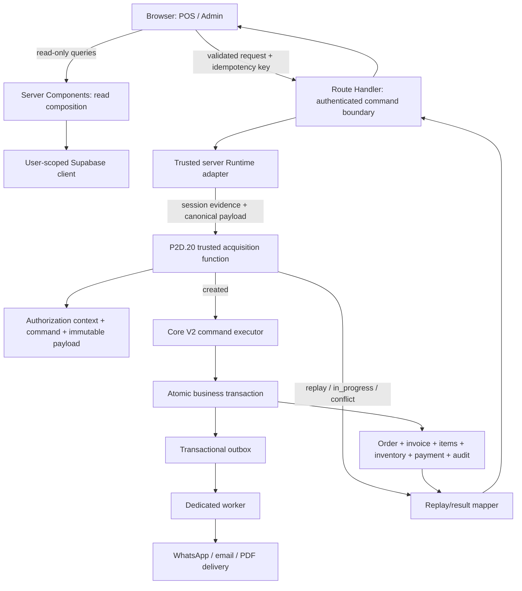
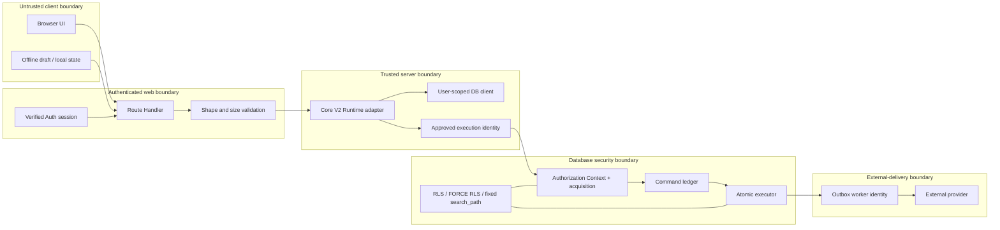
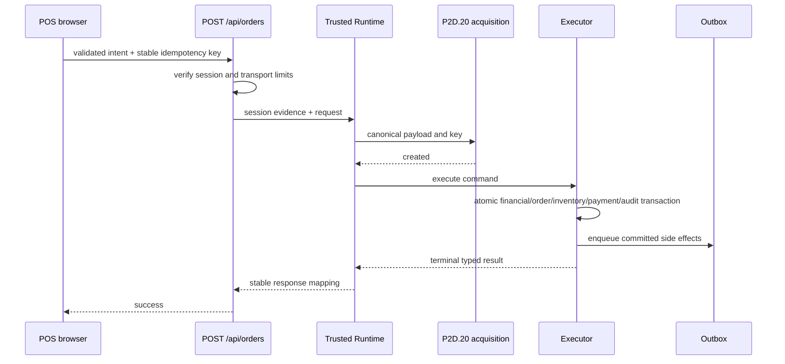
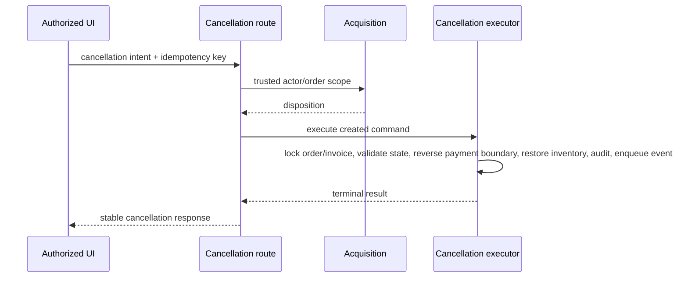

# AFEX ERP / POS — R1.2 Target Runtime Architecture

Status: authoritative implementation architecture; planning only

## Current-state summary

R1.1 establishes that live order creation enters through
`hooks/use-invoice-checkout.ts` and `POST /api/orders`, then invokes
`create_invoice_with_items_safe`. Payment snapshot, employee attribution,
inventory-movement attribution, audit, cost snapshot, PDF, and WhatsApp work
are separate follow-ups. Cancellation updates the invoice before a separate
inventory-restoration RPC. POS order status has both browser-direct and
API-mediated mutations. Service-role access is widespread.

P2D.19 and P2D.20 are installed and attested, but no application caller invokes
the trusted acquisition function. `lib/core-v2/**` and `lib/atomic-order/**`
are unwired foundations, not competing Production authorities.

The target architecture makes P2D.20 the only Core V2 acquisition authority,
introduces one server-only executor boundary, and permits exactly one write
engine per request. Legacy behavior remains available only as a feature-flag
rollback path before the request enters Core V2. There is no dual write.

## Architectural invariants

1. The browser never receives database-owner, function-owner, service-role, or
   worker credentials.
2. Authenticated identity comes from the verified Supabase session, never from
   request JSON.
3. Tenant, branch, actor, role, and capability evidence are derived
   server-side and revalidated by the trusted database entrypoint.
4. P2D.20 owns acquisition classification: `created`, `replay`,
   `in_progress`, or `fingerprint_conflict`.
5. A `created` command is executed once through the reviewed executor contract.
6. A replay reads immutable command/result evidence; it never rebuilds mutable
   customer, catalog, price, stock, or authorization state.
7. Financial, numbering, initial inventory, payment linkage, attribution,
   audit, and transactional outbox changes commit atomically where the command
   contract requires them.
8. Notifications are delivered only from committed outbox events.
9. No request invokes both the legacy order RPC and Core V2.
10. A failure is explicit. There is no silent fallback from Core V2 to legacy.

## Target architecture

## Trust-boundary diagram

## Runtime responsibility matrix

| Layer | Required responsibilities | Must not do |
|---|---|---|
| Browser/client | Collect intent; create and persist an opaque idempotency key per logical submission; prevent duplicate clicks; render typed results; preserve offline draft identity | Supply trusted actor/tenant/role/capability; call Core V2 functions; directly mutate order, payment, inventory, or command tables |
| Server Components | Compose authenticated read models; preload safe read data | Perform financial or operational writes during render |
| Route Handlers | Verify session; enforce method/content/size; map transport errors; invoke one trusted adapter; preserve response contract during cutover | Use request claims as authority; issue parallel business writes; silently fall back |
| Server Actions | Retained only for non-Core-V2 mutations after explicit authorization review | Create/cancel orders or mutate Core V2 ledgers |
| Trusted server Runtime | Resolve request correlation; normalize against P2D.18A; call acquisition; dispatch typed results; emit safe telemetry | Generate authoritative contexts locally; use global cache for authorization; expose secrets |
| User-scoped client | Read data allowed by RLS; support ordinary authenticated read workflows | Bypass RLS or perform Core V2 command writes |
| Service-role client | Exceptional server-only administrative/provider operations with explicit actor, tenant, branch, and operation checks | Serve as the default runtime client; reach the browser; bypass missing authorization |
| Authorization Context issuer | Database-derived actor/tenant/branch/capability evidence; expiry; idempotency and fingerprint binding | Trust browser role/capability fields |
| Command executor | Claim eligible command; validate state; execute reviewed transaction; record terminal result | Reacquire under mutable evidence; execute an already terminal command |
| Idempotency layer | Own scoped key hash; distinguish replay, progress, and conflict; preserve retry identity | Treat a new key as a retry; reuse keys across logical orders |
| Command ledger | Durable state, attempts, immutable request/result references, timestamps, failure classification | Store secrets or mutable payload identity |
| Replay layer | Return stored stable result/error mapping | Requery current catalog, customer, inventory, or authorization to reconstruct success |
| Inventory layer | Validate and mutate stock within command transaction; record actor/command attribution | Perform post-success correction for initial deduction |
| Payment layer | Validate method/evidence; prevent duplicate linkage; persist command-bound payment state | Trigger provider delivery inside the core transaction |
| Outbox | Record durable deduplicated events in the business transaction | Deliver externally before commit |
| Worker | Claim events with dedicated identity; retry with backoff; quarantine poison events; record delivery evidence | Modify orders, financial totals, or authorization evidence |
| Observability/audit | Correlation ID, command ID, disposition, stage timing, safe error code, worker lag, immutable audit event | Log PII, payloads, credentials, PINs, tokens, or secrets |

## Credential and database-role matrix

| Layer | Allowed credential | Allowed role/access | Allowed calls | Prohibited |
|---|---|---|---|---|
| Browser | Supabase user session only | `anon`/`authenticated` through RLS | Read APIs and reviewed user-scoped RPCs | Service role; function-owner; Core V2 table access |
| Route | Verified user session plus server environment | User-scoped reads; trusted adapter | Runtime adapter only for Core V2 writes | Direct ledger/table writes |
| Trusted adapter | Server-held approved execution identity | Exact dedicated Runtime contract | P2D.20 acquisition and reviewed executor only | Arbitrary tables/RPCs |
| Acquisition | `SECURITY DEFINER`, fixed `search_path`, approved owner | Column-limited authorization evidence plus ledger writes | Frozen P2D.20 dependencies | Browser/service-role EXECUTE unless frozen contract explicitly permits it |
| Executor | Dedicated server execution identity | EXECUTE on reviewed executor | Command claim/execute/result functions | Direct application-table grants beyond contract |
| Worker | Dedicated worker identity | Outbox claim/result functions | Outbox-only RPCs | Order/customer/catalog direct mutation |
| Admin legacy routes | Server service role temporarily | Route-specific tables/RPCs | Only documented retained paths | Cross-tenant access or use without actor checks |

## Prohibited-access matrix

| Actor/layer | Prohibited access |
|---|---|
| Browser | `atomic_authorization_contexts`, `atomic_order_commands`, durable payload, executor, outbox tables, service-role key |
| Server Component | Core business writes and command execution |
| Generic service role | Direct Core V2 ledger mutation; bypassing acquisition; replay execution |
| Runtime adapter | Auth administration, provider credentials, arbitrary SQL, direct order/inventory/payment writes |
| Executor | External network, WhatsApp/email send, browser response construction |
| Worker | Financial recomputation, order mutation, tenant selection from event payload without trusted binding |
| Replay | Mutable business reads used to alter recorded result |

## Canonical command flows

### A. Create POS order

- Entry point: existing `POST /api/orders`, selected before any write.
- Authentication: verified user session; PIN-derived employee evidence where
  required is server-bound, not trusted from JSON.
- Validation: browser convenience validation, route shape/size validation,
  Runtime canonicalization, database acquisition and executor revalidation.
- Retry: same logical submission reuses the same idempotency key.
- Replay: returns the stored terminal result.
- Side effects: business records, inventory, payment linkage, audit, and outbox
  commit atomically; provider delivery is asynchronous.
- Prohibited: legacy RPC call, direct invoice patch, direct inventory
  attribution patch, synchronous external delivery.
- Failure: no partial business success; typed retryable or terminal result.

### B. Create Admin order

No distinct Admin creation endpoint was found. Admin creation must use the same
command route and contract as POS, with a different database-derived
authorization capability where supported. If future requirements demand a
separate endpoint, it remains a transport wrapper over the same Runtime and
executor. It must not create a second engine.

### C and D. Cancel order and restore inventory

Cancellation and restoration are one command and one transaction. Duplicate
cancellation replays the original result. Already-cancelled legacy records
need a reviewed compatibility classification; no unconditional second restore
is allowed. A failed cancellation commits neither status nor restoration.

### E through H. Retry, replay, duplicate, and conflict

| Scenario | Required behavior | Prohibited behavior |
|---|---|---|
| Interrupted before acquisition response | Retry same key and fingerprint; database classifies current state | Generate a new key automatically |
| Interrupted during execution | Retry returns `in_progress` or later replay; worker/operator follows command state | Invoke legacy path |
| Terminal command replay | Return immutable stored result and stable response status | Rebuild from mutable tables |
| Duplicate same key/same fingerprint | `in_progress` while active; replay when terminal | Create another command/order |
| Same key/different fingerprint | `fingerprint_conflict`; no new records or side effects | Accept altered payload |

### I and J. Payment success and failure

- Payment evidence is validated and linked inside the atomic command when the
  method is synchronous.
- A successful payment cannot be recorded twice for the same command.
- A validation or persistence failure rolls back order, invoice, inventory,
  audit, and outbox changes.
- External asynchronous provider capture, if introduced, is a separate
  idempotent command/state machine; it may not be modeled as an assumed
  synchronous success.
- Refund/reversal semantics are unresolved and require the Batch F contract
  decision before implementation.

### K. Notification and outbox delivery

1. Executor writes a deduplicated outbox event in the command transaction.
2. Worker claims an event with a lease.
3. Provider call uses an event delivery idempotency key.
4. Success records provider reference and delivery timestamp.
5. Retryable failure schedules bounded exponential retry.
6. Permanent failure moves to poison/quarantine state and alerts operations.
7. Replay of the business command does not enqueue a duplicate event.

## Error and response boundaries

| Boundary | Internal detail retained | Client exposure |
|---|---|---|
| Transport validation | Field/path and safe validation code | Stable 400-class code; no SQL/internal body |
| Authentication | Session/provider error and correlation | 401 with generic message |
| Authorization | Denied capability/scope and command correlation | 403 with stable code; no role catalog detail |
| Acquisition conflict | Command/key/fingerprint classification | 409 `fingerprint_conflict` |
| In progress | Command reference and retry timing | 409/202 contract selected once and kept stable |
| Replay | Stored terminal response mapping | Same logical response as original |
| Executor validation | Safe domain code and stage | Stable business error; no stack/SQL |
| Unexpected failure | Full server-only trace with redaction | 500 plus safe correlation reference |
| Worker failure | Event, attempt, provider-safe code | Not returned through original order response |

## Observability architecture

- Correlation chain: HTTP request reference → idempotency-key digest →
  authorization-context ID → command ID → execution-attempt ID → audit/outbox
  event ID → provider delivery ID.
- Required metrics: acquisition disposition, acquisition latency, executor
  latency by stage, lock wait, retry count, replay count, conflict count,
  command age, outbox depth/lag, worker attempts, provider latency, poison
  count, and legacy/Core-V2 route selection.
- Required logs: structured safe identifiers, tenant/branch opaque IDs where
  policy permits, code/version, feature-flag decision, and stable error code.
- Forbidden logs: raw idempotency key, canonical payload, customer contact
  data, PIN, access/refresh token, authorization context, service key, provider
  secret, card data, or password material.
- Tracing must distinguish time in authentication, acquisition, execution,
  response mapping, and post-commit delivery.
- Audit evidence is a required transactional record, not a substitute for
  diagnostic logs.

## Cutover strategy

Chosen strategy: feature-flagged, branch-by-branch canary inside an approved
tenant, with optional read-only/shadow validation that creates no durable
business or command records.

| Strategy | Decision |
|---|---|
| Direct cutover | Rejected: blast radius is too large |
| Global feature flag | Required as kill switch, but insufficient alone |
| Tenant-by-tenant | Supported after first branch canary |
| Branch-by-branch | Primary rollout unit because inventory and employee scope are branch-bound |
| Dual-read | Allowed for non-mutating response comparison |
| Shadow verification | Allowed only if read-only; P2D.20 acquisition itself is durable and is not a harmless shadow call |
| Compatibility wrapper | Allowed at the route selector before any write |
| Dual-write | Prohibited unless a separately approved deterministic reconciliation contract exists; none exists now |

The selector chooses legacy or Core V2 once, before acquisition or any business
write. An exception after Core V2 selection never falls back to legacy.

## Rollback levels

| Level | Action | Limitation |
|---|---|---|
| UI/runtime | Revert UI integration while preserving API contract | Does not undo committed commands |
| API route | Disable Core V2 selector for new requests | Only safe before a request enters acquisition |
| Executor | Pause new claims; allow known committed transactions to remain | Acquired commands may remain pending and need governed resume |
| Feature flag | Disable branch/tenant/global Core V2 entry | Must be fail-closed and audited |
| Command processing | Pause executor with queue/age alerts | No legacy fallback for already acquired commands |
| Worker | Pause notification delivery | Business commits remain valid; outbox backlog retained |
| Database | Forward-fix preferred; installed ledgers and committed business records are durable | Automatic destructive rollback is prohibited |
| Already committed | Return replay; finish durable outbox separately | Never recreate or reverse silently |
| Replay after rollback | Replay from immutable result remains valid | New commands route according to current flag |

## Canonical testing pyramid

1. Static validation: type checking, lint, dependency/forbidden-import scans.
2. Unit tests: canonicalization, financials, inventory, error mapping,
   idempotency-key lifecycle.
3. Contract tests: P2D.18A request bytes, acquisition dispositions, response
   compatibility.
4. Route tests: auth, validation, selector, no-fallback behavior.
5. RPC tests: frozen signatures, role/ACL/search-path behavior.
6. Authorization tests: roles, capabilities, actor/tenant/branch derivation.
7. Isolation tests: cross-tenant and cross-branch denial.
8. Concurrency tests: simultaneous first insert, claim, duplicate, cancellation,
   inventory contention.
9. Idempotency and replay tests: same key/same payload, conflict, interrupted
   response, stable replay.
10. Failure injection: each transaction stage, post-commit worker, provider
    timeouts, and process termination.
11. Browser tests: complete POS/Admin flows without real provider delivery.
12. Device tests: POS tablet, mobile, desktop navigation and duplicate-click
    behavior.
13. Production read-only verification: flags, privileges, drift, command and
    outbox health.
14. Performance tests: p50/p95/p99, query plans, lock waits, load, soak, outbox
    throughput and lag.

## Production safety gates

- No activation until Batches A–F and required SQL reviews are complete.
- Customer phone search and customer creation defects must be corrected and
  regression-tested in Batch E before POS canary; otherwise checkout cannot
  reliably construct the frozen customer state.
- Limited Production rollout begins only after Batch K passes and Batch M has
  no unresolved Critical/High finding.
- Legacy order creation is disabled only after all enabled branches use Core
  V2, acquired commands have no unsafe backlog, replay is proven, rollback
  drills pass, and the Batch J privilege-closure evidence is approved.

`R1_201_TARGET_RUNTIME_ARCHITECTURE_COMPLETE`
